# 1. INTERCONEXIÓN ORACLE → ORACLE

El enlace solo puede ser de un servidor al otro, por lo que no es bidireccional, habrá que crear un enlace en cada servidor que apunte al otro servidor.

Por ejemplo, si queremos hacer un enlace de base de datos desde el Servidor 1 al Servidor 2, necesitaremos un usuario en el servidor 1 que tenga permisos para crear enlaces de base de datos y un usuario en el servidor 2 que será con el que nos autentificaremos desde el servidor 1.

## 1.1 CREACIÓN DE USUARIOS:

**Servidor 1:**

``` bash
CREATE USER robe IDENTIFIED BY robe;
GRANT CONNECT, RESOURCE TO robe;
GRANT CREATE DATABASE LINK to robe;
```

**Servidor 2:**

``` bash
CREATE USER replica IDENTIFIED BY replica;
GRANT CONNECT, RESOURCE TO replica;
GRANT CREATE DATABASE LINK TO replica;
```

## 1.2 CONFIGURACIÓN DE LISTENER.ORA Y TNSNAMES.ORA

A continuación vamos a configurar estos ficheros para poder conectarnos de un servidor a otro, ya que en el momento que un servidor actúa como cliente de otro necesita un tnsnames.ora.

**ORACLE 1:**

Vamos a utilizar la resolución de nombres para establecer la conexión de un servidor a otro, para ello añadiremos la siguiente línea en el /etc/hosts:

``` bash
192.168.122.250 oracle2
```

Donde "192.168.122.250" es la ip del servidor Oracle 2.

**tnsnames.ora:**

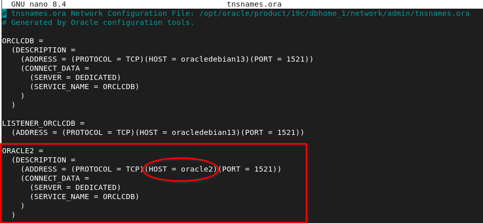

**listener.ora:**

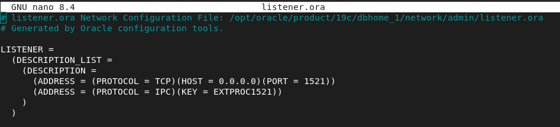

Estamos permitiendo conexiones en todas direcciones, pero porque estamos en un entorno de prueba, no deberíamos de hacer esto en un entorno real.

**ORACLE 2:**

**/etc/hosts:**

``` bash
192.168.122.79 oracle1
```

**tnsnames.ora:**

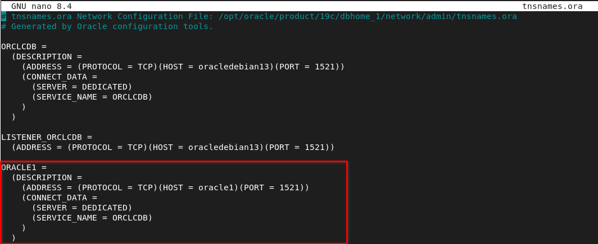

**listener.ora:**

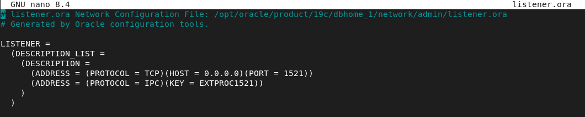

## 1.3 CREACIÓN DE ENLACE DE ORACLE 1 A ORACLE 2

Con el usuario que configuramos en Oracle 1, crearemos el enlace de base de datos a Oracle 2:

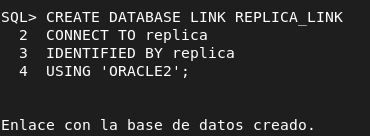

Ahora comprobamos que podamos obtener datos de una tabla del servidor enlazado:

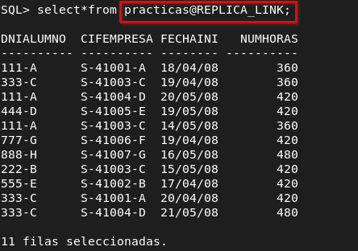

## 1.4 COMPROBACION CON TRIGGER

A continuación voy a crear un trigger que mantenga en Oracle 2 la tabla Practicas actualizada cada vez que haya un insert en Oracle 1, esto es **opcional**, no es necesario para que funcionen los enlaces de bases de datos.

``` bash
CREATE OR REPLACE TRIGGER trg_replica_practicas_insert
AFTER INSERT ON practicas
FOR EACH ROW
BEGIN
INSERT INTO practicas@REPLICA_LINK(dnialumno, cifempresa, fechainicio, numhoras)
VALUES (:NEW.dnialumno, :NEW.cifempresa, :NEW.fechainicio, :NEW.numhoras);
END;
/
```

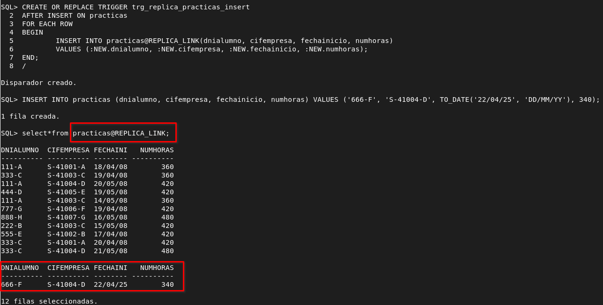

## 1.5 CREACIÓN DE ENLACE DE ORACLE 2 A ORACLE 1

Con el usuario replica crearemos el siguiente enlace de base de datos.

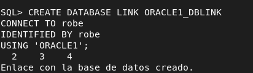

Haremos una consulta a la tabla alumnos de Oracle 1 para comprobar el funcionamiento del enlace creado.

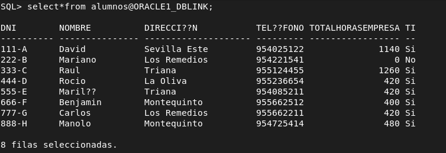

## 1.6 CONSULTAS COMBINADAS ENTRE ENLACES

Ejecutaré una consulta que obtendrá datos de la misma tabla de ambos servidores:

``` bash
select nombre from empresas where cif IN (SELECT cif FROM empresas@ORACLE1_DBLINK WHERE sector = 'Informatica')
```

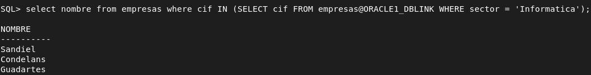

# 2. INTERCONEXIÓN POSTGRES → POSTGRES 

Vamos a instalar dos servidores postgres en dos máquinas distintas y crearemos un enlace para poder recoger datos de diferentes tablas en distintos servidores de forma remota.

## 2.1 CONFIGURACIÓN DE POSTGRES

Lo primero es que cada servidor postgres escuche en la dirección del otro o en un rango que abarque su dirección. Para ello voy a modificar un par de ficheros:

**/etc/postgresql/17/main:**

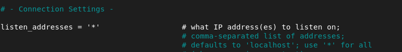

**/etc/postgresql/17/main/ph_hba_conf:**

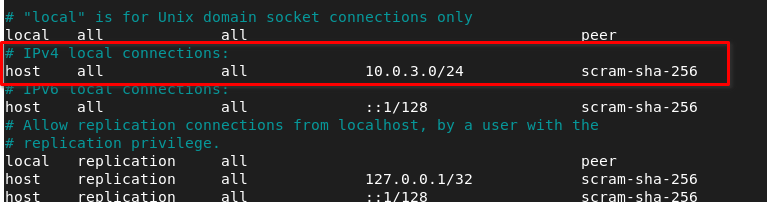

Vamos a crear un usuario en cada base de datos , una base de datos y activaremos la extensión dblink, que trae un módulo que nos permite conectarnos a la otra base de datos:

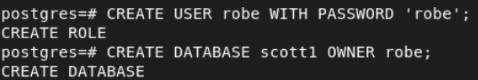

## 2.2 CONEXIÓN POSTGRES 1 A POSTGRES 2

Dentro de la base de datos scott1, que es desde donde vamos a hacer el enlace de base de datos, habilitaremos la extensión dblink:


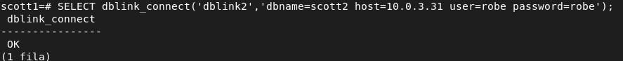

## 2.3 CONEXIÓN POSTGRES 2 A POSTGRES 1

Dentro de la base de datos scott2 habilitaremos la extensión dblink:


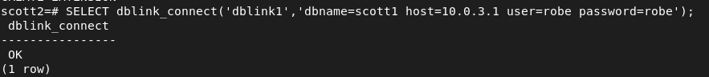

## 2.4 CONSULTAS COMBINADAS

Para que la sintaxis funcione, cuando indiquemos el nombre del campo y el tipo de dato tiene que ir en el mismo orden que la select.

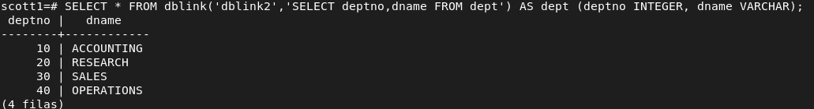

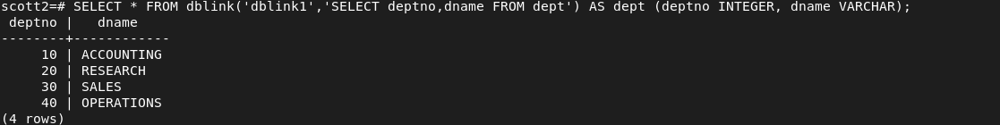

# 3. INTERCONEXIÓN POSTGRES → ORACLE

## 3.1 INSTALAR DEPENDENCIAS

En la máquina con postgres instalaremos los siguientes paquetes:

``` bash
sudo wget https://download.oracle.com/otn_software/linux/instantclient/2326000/instantclient-sdk-linux.x64-21.12.0.0.0.zip -O instantclient-sdk-23.26
https://download.oracle.com/otn_software/linux/instantclient/2112000/el9/instantclient-basic-linux.x64-21.12.0.0.0dbru.el9.zip -O instantclient-basic-23.26 https://download.oracle.com/otn_software/linux/instantclient/2112000/el9/instantclient-sqlplus-linux.x64-21.12.0.0.0dbru.el9.zip -O instantclient-sqlplus-23.26
```

**Descomprimir:**

``` bash
sudo unzip instantclient-sdk-23.26
sudo unzip instantclient-basic-23.26
sudo unzip instantclient-sqlplus-23.26
```

**Dependencias del sistema linux:**

``` bash
sudo apt install libaio1t64 postgresql-server-dev-all build-essential git zip -y
```

**Variables de entorno de oracle:**

``` bash
echo "export ORACLE_HOME=/opt/oracle/instantclient_21_12" >> .bashrc
echo "export PATH=$ORACLE_HOME:$PATH" >> .bashrc
echo "export LD_LIBRARY_PATH=$ORACLE_HOME:$LD_LIBRARY_PATH" >> .bashrc
```

Para acceder a la base de datos lo hacemos con la siguiente instrucción:

``` bash
sqlplus robe/robe@//192.168.122.79:1521/ORCLCDB
```

Ahora tenemos que descargar oracle fdw, para ello tenemos que compilarlo de un repositorio de github:

``` bash
git clone https://github.com/laurenz/oracle_fdw.git
cd oracle_fdw
make
sudo make install
```

## 3.2 SOLUCIÓN DE ERROR DE LIBERÍAS

Ahora tenemos que entrar en postgres a la base de datos scott1 y crear la extension de oracle_fdw:

``` bash
scott1=# CREATE EXTENSION oracle_fdw;
```

``` bash
ERROR: no se pudo cargar la biblioteca «/usr/lib/postgresql/17/lib/oracle_fdw.so»: libclntsh.so.21.1: no se puede abrir el fichero del objeto compartido: No existe el fichero o el directorio
```

Puede dar ese problema, es porque el .bashrc afecta a la sesión actual, en momento que entremos a postgres con una bash o shell con distinto pid a la que está utilizando el usuario que carga el .bashrc, entonces nos surgirá este error porque postgres no está leyendo las variables de entorno, esto ocurre porque postgres es un demonio en segundo plano.

La solución es la siguiente:

``` bash
echo "/opt/oracle/instantclient_21_12" | sudo tee /etc/ld.so.conf.d/oracle-instantclient.conf
sudo ldconfig
```

De esta forma registramos los directorios de instantclient en el sistema global y volvemos a cargar las librerías para que postgres las detecte.

## 3.3 CONFIGURACIÓN DEL ENLACE

Procedemos a cargar la extensión de oracle_fdw de nuevo:

``` bash
CREATE EXTENSION oracle_fdw;
```

Creamos el esquema oracle :

``` bash
CREATE SCHEMA oracle;
```

Creamos un servidor foráneo que hace referencia a la base de datos del servicio de ORACLE que hay en la otra máquina:

``` bash
create server oracle foreign data wrapper oracle_fdw options (dbserver '//192.168.122.79/ORCLCDB');
```

Vamos a mapear el usuario local de postgres y el del servidor de oracle, con el de oracle nos identificamos con contraseña:

``` bash
create user mapping for robe server oracle options (user 'robe', password 'robe');
```

Por último le damos a privilegios al usuario que hemos creado en postgres sobre el esquema oracle y el servidor foráneo.

``` bash
grant all privileges on schema oracle to robe;
grant all privileges on foreign server oracle to robe;
```

``` bash
import foreign schema "RAUL" from server oracle_prueba into raul;
```

**Ahora accedemos con el usuario robe a la base de datos scott1 y comprobamos que pueda consultar tablas de oracle:**

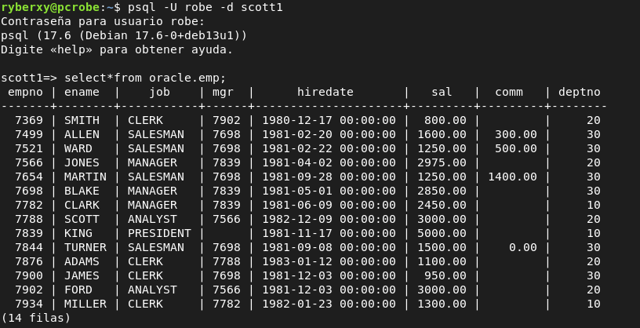

# 4. INTERCONEXIÓN ORACLE → POSTGRES

## 4.1 INSTALACIÓN Y CONFIGURACIÓN DEL DRIVER ODBC

En la máquina oracle que será cliente de postgres instalaremos unixodbc y odbc-postgresql, el controlador para postgres.

``` bash
apt update && apt install unixodbc odbc-postgresql -y
```

Vamos a modificar el fichero /etc/odbcinst.ini:

``` bash
#[PostgreSQL ANSI]
#Description=PostgreSQL ODBC driver (ANSI version)
#Driver=psqlodbca.so
#Setup=libodbcpsqlS.so
#Debug=0
#CommLog=1
#UsageCount=1

[PostgreSQL Unicode]
Description=PostgreSQL ODBC driver (Unicode version)
Driver=/usr/lib/x86_64-linux-gnu/odbc/psqlodbcw.so
#Setup=libodbcpsqlS.so
Debug=0
CommLog=1
UsageCount=1
```

He comentado las líneas que no nos sirven, ya que utilizaremos una conexión unicode, además he comentado el setup porque en sistemas operativos actualizados no existe libodbcpsqlS.so ya que no es necesario para que el driver funcione, era una librería auxiliar de ODBC.

el debug registra logs detallados para ver el diagnóstico de lo que está pasando, lo dejamos en 0 de momento.

CommLog = 1, está activado y sirve para registrar las comunicaciones entre cliente y servidor, mientras que UsageCount lleva el conteo de cuantas veces se ha utilizado el driver.

Ahora configuraremos el DSN, la fuente de datos a la que nos conectaremos:

/etc/odbc.ini:

``` bash
[PSQLU]
Debug = 0
CommLog = 0
ReadOnly = 0
Driver = PostgreSQL Unicode
Servername = 192.168.122.1
Username = robe
Password = robe
Port = 5432
Database = scott1
Trace = 0
TraceFile = /tmp/sql.log
```

La directiva Trace la podemos poner a 1 si queremos sirve para guardar las consultas que se van realizando.

ReadOnly lo dejamos en 0 para poder escribir, no solo leer.

Antes dentro de la base de datos que corresponda, scott1 en este caso, debemos darle privilegios al usuario robe:

``` bash
GRANT SELECT, INSERT, UPDATE, DELETE ON public.<tabla> TO robe;
```

Para comprobar que funciona:

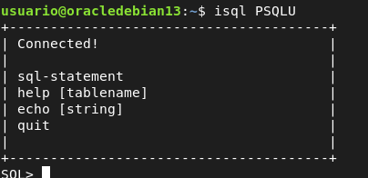

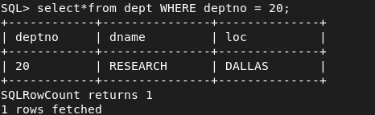

## 4.2 HETEROGENEUS SERVICE (HS)

Ahora que hemos verificado que el driver funciona, crearemos un servicio heterogéneo HS, para que oracle pueda hacer uso del driver mediante el enlace de base de datos que crearemos.

/opt/oracle/product/19c/dbhome_1/hs/admin/initPSQLU.ora:

``` bash
HS_FDS_CONNECT_INFO = PSQLU
HS_FDS_TRACE_LEVEL = DEBUG
HS_FDS_SHAREABLE_NAME = /usr/lib/x86_64-linux-gnu/odbc/psqlodbcw.so
HS_LANGUAGE = AMERICAN_AMERICA.WE8ISO8859P1
set ODBCINI=/etc/odbc.ini
```

Configurar listener.ora:

**/opt/oracle/product/19c/dbhome_1/network/admin/listener.ora:**

``` bash
SID_LIST_LISTENER =
(SID_LIST =
(SID_DESC =
(SID_NAME = PSQLU)
(ORACLE_HOME=/opt/oracle/product/19c/dbhome_1)
(PROGRAM=dg4odbc)
)
)
```

Estamos creando una especie de puente entre oracle y postgres de modo que se utiliza HS service para llamar al programa dg4odbc. Por lo tanto SID_NAME aquí no es una nueva instancia, solo es un alias lógico que sirve para la conexión de oracle a postgres.

Configurar tnsnames.ora

**/opt/oracle/product/19c/dbhome_1/network/admin/tnsnames.ora:**

``` bash
PSQLU =
(DESCRIPTION=
(ADDRESS=(PROTOCOL=tcp)(HOST=localhost)(PORT=1521))
(CONNECT_DATA=(SID=PSQLU))
(HS=OK)
)
```

Ahora apagaremos y levantaremos con lsnrctl, listener control los listener configurados en listener.ora:

``` bash
lsnrctl stop
lsnrctl start
lsnrctl services
```

Tras ver los servicios de listener, si sale el que hemos configurado y todo esta bien, podemos crear en dblink y utilizarlo:

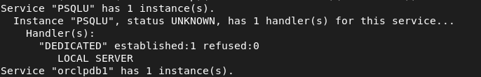

## 4.3 CREACIÓN DEL DBLINK

**dblink:**

``` bash
CREATE DATABASE LINK dblink_postgres CONNECT TO "robe" IDENTIFIED BY "robe" using 'PSQLU';
```

La identificación es del usuario de postgres.

Ya podemos desde oracle consultar datos a la base de datos de postgres.

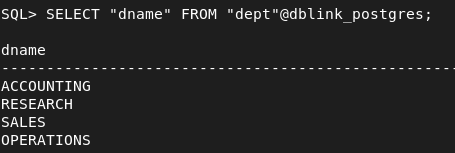

# 5. CAMBIAR NAME INSTANCIA Y CREAR ESQUEMA DE USUARIO ORACLE

``` bash
###### cambiar nombre de la instancia
sqlplus / as sysdba
alter system checkpoint;
alter system switch logfile;
shutdown immediate;
startup mount;
create pfile='/tmp/init_nuevo2.ora' from spfile;
#linux
cp /tmp/init_nuevo.ora $ORACLE_HOME/dbs/init<newsid>.ora
cambiar parametro db_name=newsid
export ORACLE_SID=oldsid
nid target=/ dbname=newsid

export ORACLE_SID=newsid
chown oracle:oinstall $ORACLE_HOME/dbs/initGN.ora
chmod 644 $ORACLE_HOME/dbs/initGN.ora
sqlplus / as sysdba
STARTUP MOUNT PFILE='$ORACLE_HOME/dbs/initGN.ora';
ALTER DATABASE OPEN RESETLOGS;
select name from v$database;
######Crear esquema usuario en oracle
alter session set "_ORACLE_SCRIPT"=true;

CREATE USER user IDENTIFIED BY contraseña;
GRANT CONNECT, RESOURCE TO RAUL;
GRANT CREATE SESSION, CREATE TABLE, CREATE VIEW, CREATE SEQUENCE TO RAUL;
GRANT CREATE DATABASE LINK TO usuario_oracle;
ALTER USER RAUL QUOTA UNLIMITED ON USERS;
```
