# 1. Instalación de wireshark en Debian 12

## 1.1 Introducción

Wireshark es una herramienta analizadora de protocolos que captura y analiza los paquetes de datos que se intercambian a través de una red. Permite investigar y solucionar problemas en las comunicaciones y es compatible con un amplio abanico de protocolos de red, como TCP, UDP, HTTP, DNS, entre otros.

Proporciona una serie de utilidades de organización y filtrado de información que permiten analizar todo el tráfico que pasa por la red, desde paquetes perdidos y problemas de latencia hasta actividad maliciosa.

Otras características de wireshark son la posibilidad de seguir un flujo TCP completo (TCP stream) pudiendo personalizar los filtros sin perder el flujo, decodificar cualquier paquete y exportarlos en formatos específicos para guardarlos, ver estadísticas de los paquetes capturados y reensamblar paquetes. Además cuenta con Tshark, que es la versión de línea de comandos de Wireshark, y con otras utilidades de terminal como rawshark, editcap, mergecap y text2pcap.

Los administradores de sistemas y de red hacen uso de esta herramienta para identificar dispositivos defectuosos que descartan paquetes, problemas de latencia, filtraciones de datos de una organización, incluso intentos de intrusión contra alguna organización.

Los requisitos mínimos para hacer uso de este software no son muy exigentes, lo más importante es tener una tarjeta de red compatible para poder capturar, aunque hoy en día no es una preocupación porque suelen venir integradas en los ordenadores.

## 1.2 Descarga del paquete

Lo primero que tenemos que hacer cuando vayamos a instalar un paquete es comprobar si está disponible para nuestro sistema operativo, para ello nos dirigimos a la página oficial de wireshark:

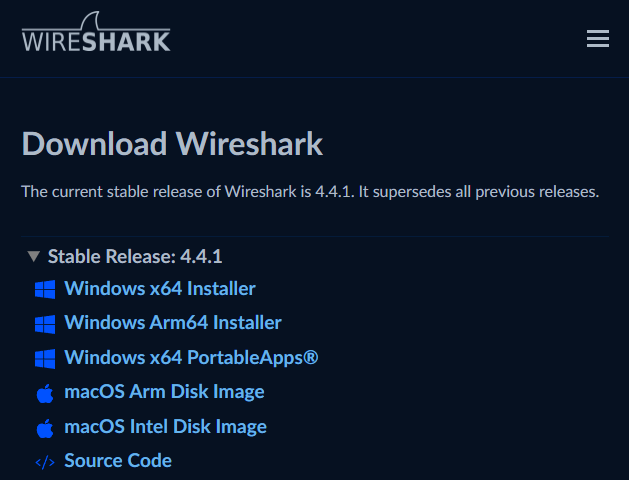

Como podemos observar no aparece ninguna descarga para GNU/Linux, esto se debe a que en GNU/Linux se utiliza un sistema de paquetes y tendríamos que ver si el paquete de wireshark está en los repositorios de nuestra distribución (Debian 12), de nuevo visitando la página oficial:

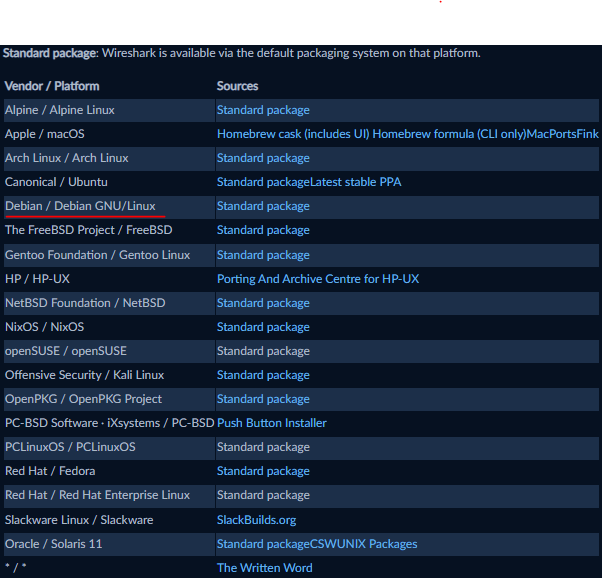

En este caso el paquete wireshark sí está en los repositorios oficiales de Debian.

Cada vez que vayamos a instalar un paquete de los repositorios podemos utilizar el comando `apt policy nombre_del_paquete` para saber qué versión está disponible en los repositorios de nuestro sistema operativo y si el paquete está instalado o no.

Una vez hecho esto, procedemos a introducir el siguiente comando para llevar a cabo la instalación:

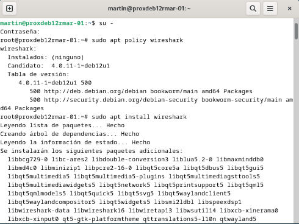

Durante la instalación nos saldrá un cuadro que preguntará si los usuarios que no son superusuarios pueden realizar capturas, en mi caso señalaré que sí.

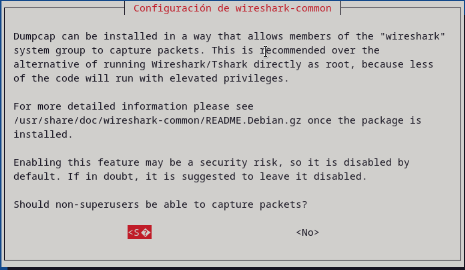

A continuación, si abrimos la aplicación e intentamos realizar una captura, nos devolverá permiso denegado. Esto ocurre porque nuestro usuario todavía no tiene permisos sobre la herramienta que realiza las capturas, dumpcap. En mi caso ejecuté el siguiente comando:


El `+x` da permiso de ejecución (x viene de *execute*) sobre el archivo indicado. Aun así, la forma recomendada en Debian es añadir nuestro usuario al grupo `wireshark`, que es el que tiene permiso para usar dumpcap tras responder que sí en el paso anterior, y después cerrar sesión y volver a entrar:

``` bash
sudo usermod -aG wireshark $USER
```

## 1.3 Funcionamiento de wireshark

Abriremos el programa para ver que funciona de forma correcta y realizaremos una petición DNS.

Una petición DNS es una solicitud que se realiza a un servidor DNS (o servidor de nombres), que traduce el nombre de dominio solicitado a una dirección IP. En mi caso realizaré la captura de paquetes sobre la interfaz de red ethernet ens18 y haré una petición DNS a la página www.pccomponentes.com:

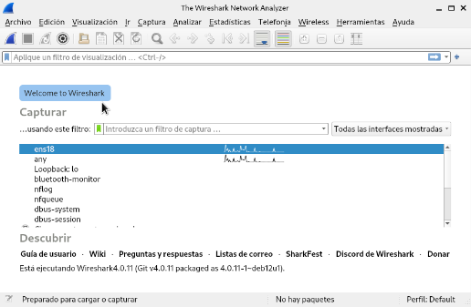

Como podemos observar he usado el filtro `dns` para que solo me salgan paquetes con el protocolo DNS.

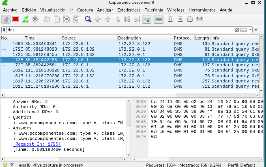

# 2. Instalación de GNS3 en Debian 12

## 2.1 Introducción

GNS3 es un simulador de redes de computadoras de código abierto que permite a los usuarios diseñar, construir y simular redes combinando dispositivos tanto reales como virtuales.

Los requerimientos recomendados para usar esta herramienta son:

- **Sistema operativo:** Windows 7 (64 bit) o superior, o una distribución GNU/Linux de 64 bits como Debian.

- **Procesador:** 4 o más núcleos (aunque con 2 núcleos se puede tirar).

- **Virtualización:** Se requieren extensiones de virtualización. Es posible que debas habilitarlas en la BIOS de tu ordenador.

- **Espacio en disco:** Se recomiendan 35 GB disponibles, aunque con 2 GB basta para almacenar el programa y algunas imágenes.

- **Notas adicionales:** La virtualización de dispositivos consume mucho procesador y memoria, por tanto hay que tener en cuenta que la topología que montemos no supere la RAM y la potencia de procesamiento de nuestro equipo.

Para que GNS3 funcione correctamente y pueda completar las simulaciones requiere de estos paquetes:

- **GNS3 GUI:** Es la interfaz gráfica que permite diseñar y simular redes.

- **Wireshark:** Para capturar el tráfico de los enlaces de la topología.

- **QEMU:** Es un emulador y virtualizador que permite ejecutar sistemas operativos en las VM.

- **Python:** Es el lenguaje de programación en el que están escritos GNS3 y la mayoría de sus scripts y herramientas.

## 2.2 Descarga del paquete

Antes de descargar el paquete comprobaremos si nuestro sistema está actualizado, entonces haremos un `sudo apt update` y si hay paquetes desactualizados haremos un `sudo apt upgrade`.

Una vez hecho esto instalaremos todos los paquetes de los que depende GNS3:

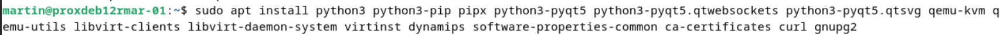

A continuación describiré para qué sirve cada paquete instalado (los paquetes de Docker los instalaremos más adelante en un paso aparte):

| PAQUETE                    | FUNCIÓN                                                                                                     |
|----------------------------|-------------------------------------------------------------------------------------------------------------|
| python3                    | Lenguaje de programación utilizado para hacer scripts y desarrollar aplicaciones y páginas web              |
| python3-pip                | Gestor de paquetes para python3 que permite instalar y gestionar bibliotecas de python                      |
| pipx                       | Instala aplicaciones de python en entornos aislados, sin mezclarlas con los paquetes del sistema            |
| python3-pyqt5              | Bindings de python para la biblioteca Qt5, que sirve para crear interfaces gráficas                         |
| python3-pyqt5.qtwebsockets | Soporte para Websockets en aplicaciones PyQt                                                                |
| python3-pyqt5.qtsvg        | Permite usar archivos SVG en aplicaciones PyQt                                                              |
| qemu-kvm                   | QEMU más el hipervisor KVM para la virtualización de máquinas                                               |
| qemu-utils                 | Utilidades de QEMU que sirven para gestionar las imágenes de disco y otras operaciones relacionadas con QEMU |
| dynamips                   | Emulador de routers Cisco que usa GNS3                                                                      |
| docker-ce                  | Es el motor de contenedores                                                                                 |
| docker-ce-cli              | Es la herramienta de línea de comandos para interactuar con Docker                                          |
| containerd.io              | Es el componente que gestiona la ejecución de los contenedores                                              |
| docker-buildx-plugin       | Mejora las capacidades de construcción de imágenes                                                          |
| docker-compose-plugin      | Facilita la gestión de aplicaciones que usan múltiples contenedores                                         |
| libvirt-clients            | Herramienta de línea de comandos para interactuar con libvirt, que gestiona la virtualización               |
| libvirt-daemon-system      | Gestiona la virtualización a nivel de sistema                                                               |
| virtinst                   | Herramientas para crear y gestionar instancias de máquinas virtuales mediante libvirt                       |
| software-properties-common | Herramientas para gestionar repositorios de software de Debian, Ubuntu y derivados                          |
| ca-certificates            | Certificados de las autoridades de certificación para conexiones HTTPS                                      |
| curl                       | Herramienta de línea de comandos para transferir datos con URL                                              |
| gnupg2                     | Es una herramienta de cifrado y firmas digitales, que utiliza OpenPGP                                       |

### 2.2.1 Dynamips

Al intentar instalar dynamips puede que el paquete no esté disponible en los repositorios actuales, por ello vamos a compilar el código fuente desde github.

1.  Buscamos el repositorio del paquete en github y lo clonamos:

> 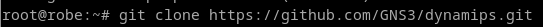

2.  Accedemos al repositorio clonado y creamos un directorio `build` para compilar fuera del código fuente y mantenerlo limpio.

> 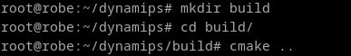
>
> Salta el siguiente error:
>
> 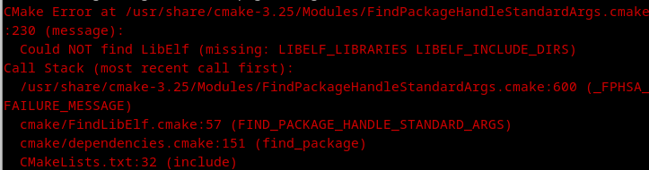
>
> Al parecer tenemos que instalar el paquete de desarrollo de libelf, que es una librería de la que depende Dynamips.
>
> 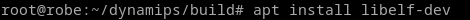

3.  Volvemos a ejecutar `cmake ..` en `dynamips/build`.

4.  Ahora lanzamos el comando `make` para compilar dynamips.

> 

5.  Por último lo instalamos en la carpeta de binarios de nuestro sistema con `sudo make install`.

> 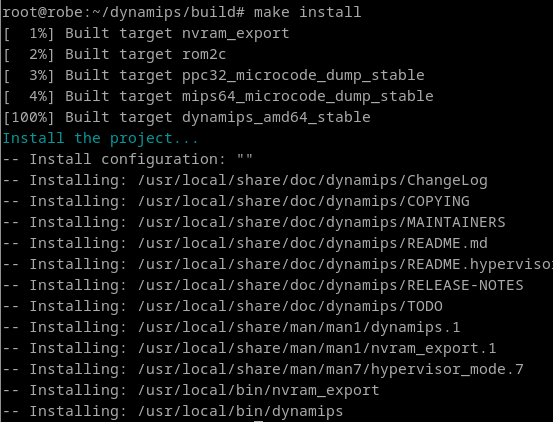
>
> Comprobamos que está instalado:
>
> 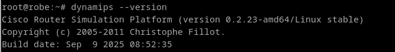

Una vez hemos instalado todas las dependencias de GNS3, instalaremos haciendo uso de pipx el servidor de GNS3 y la interfaz gráfica:

``` bash
pipx install gns3-server
pipx install gns3-gui
```

Tendremos que añadir al PATH, en el `.bashrc`, la ruta donde pipx deja los ejecutables (`~/.local/bin`) para que estos programas puedan ser ejecutados.

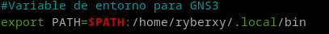

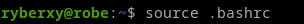

### 2.2.2 Ubridge

Clonamos el repositorio de ubridge desde github y lo compilamos con `make`. Puede que nos dé error porque no tenemos instalada la librería `libpcap-dev`; en ese caso la instalamos y volvemos a lanzar `make`:

``` bash
git clone https://github.com/GNS3/ubridge.git
cd ubridge
sudo apt install libpcap-dev
make
```

Después podemos hacer `sudo make install`, o hacerlo a mano como en la captura: damos permisos de ejecución al binario, lo copiamos a `/usr/local/bin` y le damos las capacidades necesarias para realizar capturas de red y enviar paquetes en bruto:

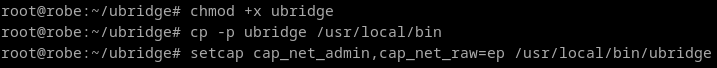

### 2.2.3 VPCS

Ahora descargamos la versión de vpcs más nueva, entramos en el directorio y luego en `src`, y ejecutaremos un script que creará el binario vpcs. Este binario lo usaremos para reemplazar el antiguo que está en `/usr/bin`:

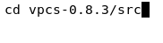

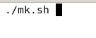

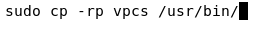

### 2.2.4 QEMU

Ahora instalaremos aparte qemu, qemu-kvm y qemu-utils porque antes no pude instalarlos debido a un error en los repositorios de que no se encuentran los paquetes.

Para ello tenemos que ejecutar el comando `sudo nano /etc/apt/sources.list` y añadir los backports para poder instalar paquetes que no están en nuestros repositorios, y con versiones más recientes, sin necesidad de actualizar nuestra distribución entera a la versión más nueva.

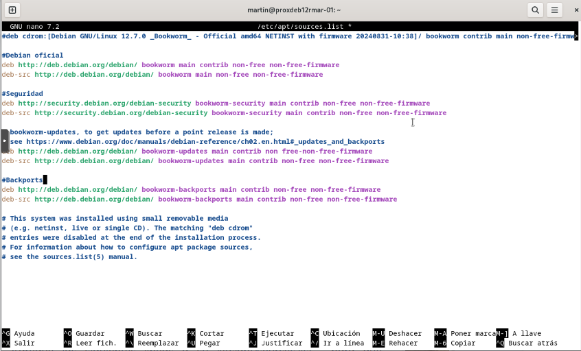

Después de hacer esto haremos un `sudo apt update` para actualizar los repositorios y si queda algún paquete desactualizado ejecutaremos `sudo apt upgrade`.

A continuación ejecutaremos el comando:


Y ahora sí debe instalarse.

### 2.2.5 Docker

Después instalaremos Docker de forma individual al igual que QEMU. Ejecutaremos en la terminal el siguiente bucle para desinstalar paquetes que puedan entrar en conflicto con los que vamos a instalar:

``` bash
for pkg in docker.io docker-doc docker-compose podman-docker containerd runc; do sudo apt-get remove $pkg; done
```

A continuación añadiremos la clave GPG oficial de Docker, con la que apt podrá verificar los paquetes que descarguemos de su repositorio:

``` bash
sudo apt update
sudo apt install ca-certificates curl # Os lo podéis ahorrar si habéis seguido paso a paso mi instalación
sudo install -m 0755 -d /etc/apt/keyrings
sudo curl -fsSL https://download.docker.com/linux/debian/gpg -o /etc/apt/keyrings/docker.asc
sudo chmod a+r /etc/apt/keyrings/docker.asc
```

Ahora añadimos el repositorio de Docker a las fuentes de apt:

``` bash
echo \
"deb [arch=$(dpkg --print-architecture) signed-by=/etc/apt/keyrings/docker.asc] https://download.docker.com/linux/debian \
$(. /etc/os-release && echo "$VERSION_CODENAME") stable" | \
sudo tee /etc/apt/sources.list.d/docker.list > /dev/null
sudo apt-get update
```

Finalmente instalaremos los paquetes de Docker:

``` bash
sudo apt install docker-ce docker-ce-cli containerd.io docker-buildx-plugin docker-compose-plugin
```

Para comprobar que funciona realizaremos la siguiente prueba:

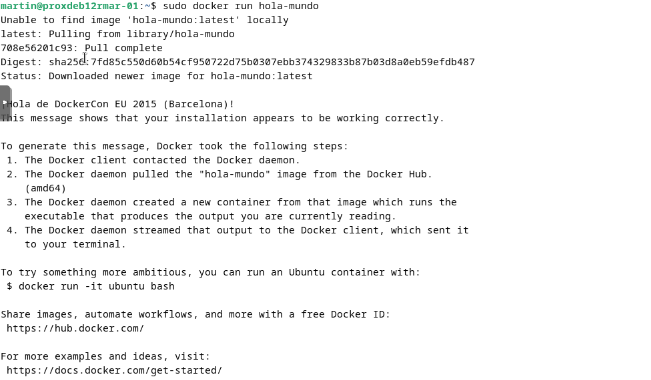

### 2.2.6 GNS3

Por último, en muchas guías se instala GNS3 con los siguientes comandos:

``` bash
sudo add-apt-repository ppa:gns3/ppa
sudo apt install gns3-server gns3-gui
```

Al ejecutarlos os saldrá un error de que no se localizan los paquetes de gns3. Esto se debe a que los PPA son repositorios exclusivos de Ubuntu y no funcionan en Debian, así que en Debian tenemos que instalar GNS3 con pip: con pipx, como hicimos antes, o en un entorno virtual. Instalarlo con pip directamente sobre el sistema no es buena idea, ya que Debian 12 lo bloquea para no mezclar paquetes de pip con los de apt.

Para hacerlo en un entorno virtual usaremos venv; yo lo llamaré `env`. Aquí podemos instalar paquetes sin que afecten al sistema.

Creamos el entorno virtual:

``` bash
python3 -m venv env
```

Lo activamos:

``` bash
source env/bin/activate
```

Ahora instalaremos GNS3 en nuestro entorno virtual:

``` bash
pip install pyqt5
pip install gns3-server
pip install gns3-gui
```

Una vez ejecutados los comandos, si queremos saber qué versión se ha instalado, si se ha instalado correctamente u otros datos adicionales de los paquetes de GNS3, utilizaremos el siguiente comando en nuestro entorno virtual: `pip3 show gns3-server gns3-gui`

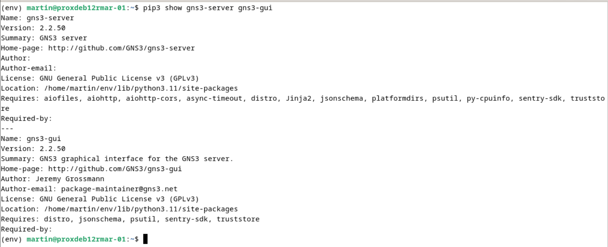

Activar el entorno virtual:

``` bash
source env/bin/activate
```

Iniciar GNS3:

``` bash
gns3
```

Para desactivar nuestro entorno virtual:

``` bash
deactivate
```

# 3. Instalación de GNS3 en Windows 10

Si vamos a la página oficial de GNS3 nos pedirá registrarnos para descargar el archivo para Windows, por eso yo lo he descargado desde la página de lanzamientos de su GitHub: [<u>Lanzamientos · GNS3/gns3-gui</u>](https://github.com/GNS3/gns3-gui/releases).

Abriremos el archivo .exe que hemos descargado y comenzará la instalación. En el menú de instalación también nos da la opción de instalar GNS3 VM (VirtualBox) y Web Client, yo instalaré ambos.

Para seguir con la instalación de GNS3 nos pedirá que instalemos también Npcap (v1.78).

Cuando termine la instalación nos ofrecerá descargar SolarWinds, que consiste en un conjunto de herramientas para supervisar el rendimiento de redes, servidores y aplicaciones. En mi caso, no la instalaré de momento porque es una herramienta para entornos más complejos y a gran escala.

Una vez instalado tendremos por otra parte la interfaz de usuario de GNS3 WebClient.

## 3.1 Escenario de topología en GNS3

Cuando iniciemos GNS3 nos preguntará dónde vamos a correr las aplicaciones, y le diremos que localmente en nuestro equipo:

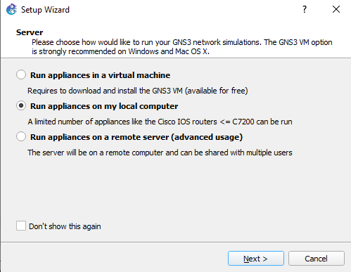

Ahora indicaremos la ruta del servidor, el host y el puerto que se utilizará:

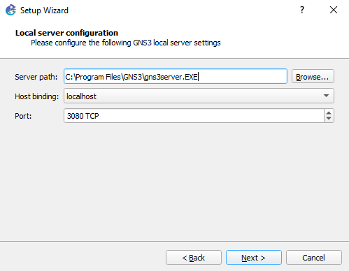

Si todo va correctamente nos saldrá este mensaje:

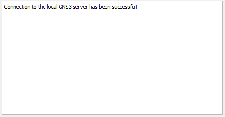

A continuación crearemos nuestro primer proyecto haciendo click sobre File en la esquina superior izquierda:

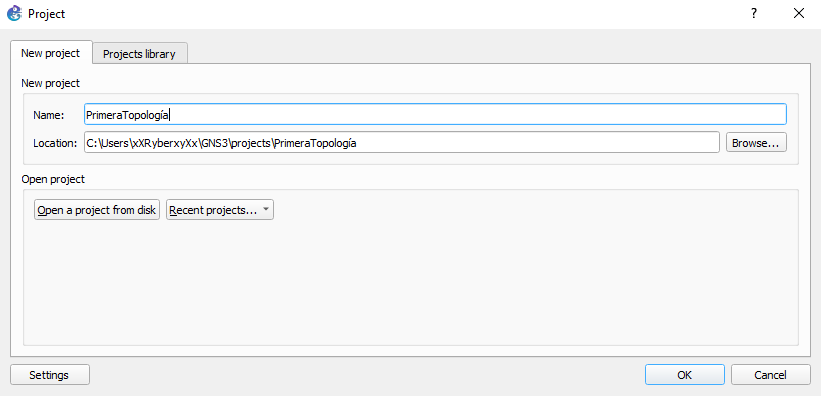

Comenzaremos con la topología, en este caso realizaré un escenario con 2 máquinas VPCS conectadas a un mismo switch que hagan ping entre ellas.

En la parte izquierda observamos un menú que nos permite arrastrar a nuestro proyecto cualquier componente que nos haga falta para nuestro escenario y en la parte superior disponemos de una barra de herramientas, donde el botón verde (reproducir) encenderá todos los dispositivos de la topología, el botón amarillo (pausar) los suspenderá y el botón rojo (detener) apagará todos los dispositivos de nuestro escenario. Hay otro botón (un cuadrado con letras) que nos permite mostrar las interfaces a las que hemos conectado los dispositivos:


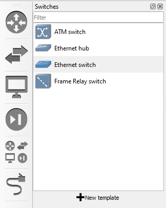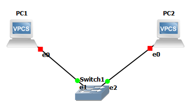

Cuando pulsemos el botón de reproducir observaremos cómo los dispositivos pasan de color rojo a verde tanto en el escenario como en el sumario de la topología.

A continuación, en la barra de herramientas le daremos al botón de abrir terminal en todos nuestros VPCS:

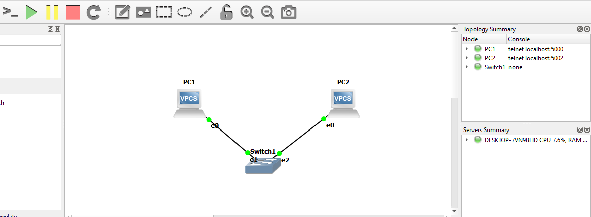

Por último configuraremos las tarjetas de red de nuestras máquinas VPCS, para ello tenemos que irnos a la terminal de la VPC 1 e introducir el siguiente comando:

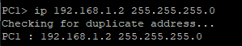

192.168.1.2 es la IP que he asignado a la VPC 1 y 255.255.255.0 es su máscara de red.

Para la VPC 2 la IP tiene que ser diferente, pero dentro de la misma red:

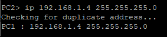

Ya tenemos configuradas las IPs de las máquinas, ahora podemos hacer ping entre ellas de la siguiente forma:

VPC 1

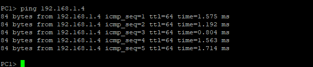

VPC 2

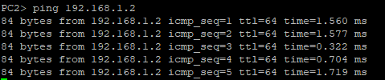

## 3.2 Instalación de GNS3 VM en Windows 10

En primer lugar entramos en la página oficial de GNS3 donde está GNS3 VM y descargamos la versión para VMware Workstation and Fusion:

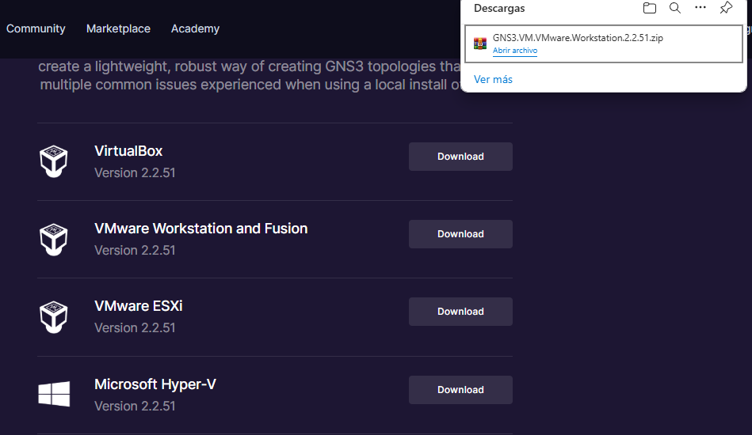

Ahora crearemos una carpeta para GNS3 VM y extraeremos ahí el archivo .zip que acabamos de descargar. Nos quedará un archivo .ova que no podremos abrir sin un software de virtualización, yo en mi caso he instalado VMware Workstation 17 (podéis descargarlo desde la página oficial, [<u>VMware Workstation Pro: Now Available Free for Personal Use - VMware Workstation Zealot</u>](https://blogs.vmware.com/workstation/2024/05/vmware-workstation-pro-now-available-free-for-personal-use.html)). Os tiene que quedar un archivo así en la carpeta:

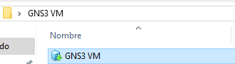

Ahora lo abriremos y nos preguntará para qué lo usaremos; si es así, marcamos uso personal:

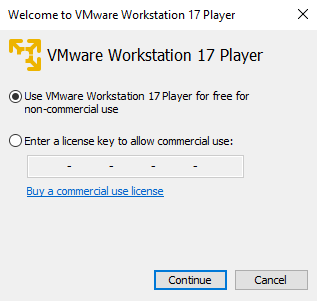

Continuamos y le ponemos un nombre a la máquina virtual:

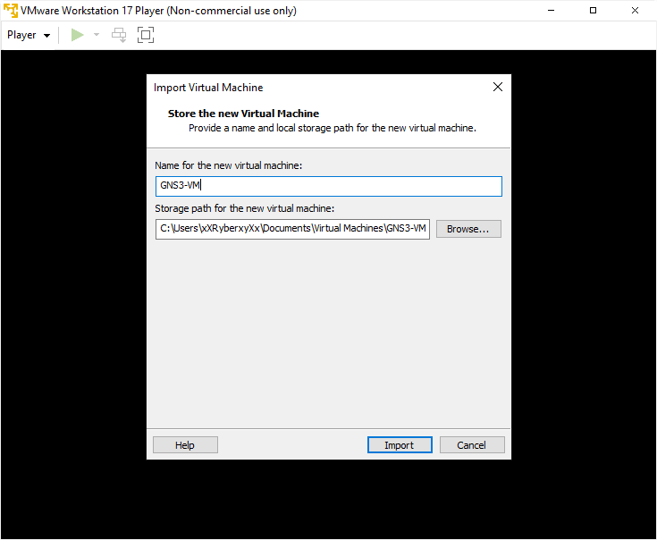

Cuando la importemos nos saldrá una serie de comandos con su función, que podremos utilizar en la VM.

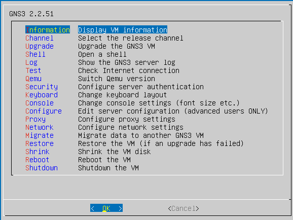

A continuación abrimos GNS3, nos vamos a Edit > Preferences y en GNS3 VM marcamos la opción de activar GNS3 VM, le damos a refrescar, aplicamos y guardamos:

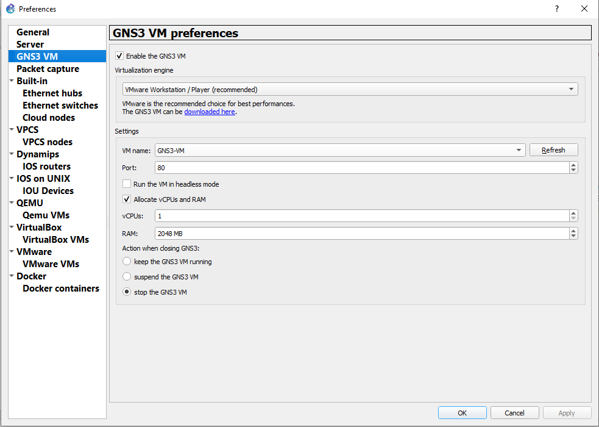

Después de hacer esto veremos que la VM ya nos aparece en el sumario:

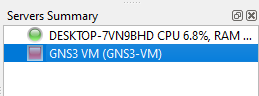

Por último abriremos VMware Workstation 17 y podremos modificar todo lo que queramos de nuestra máquina virtual, incluso crear más:

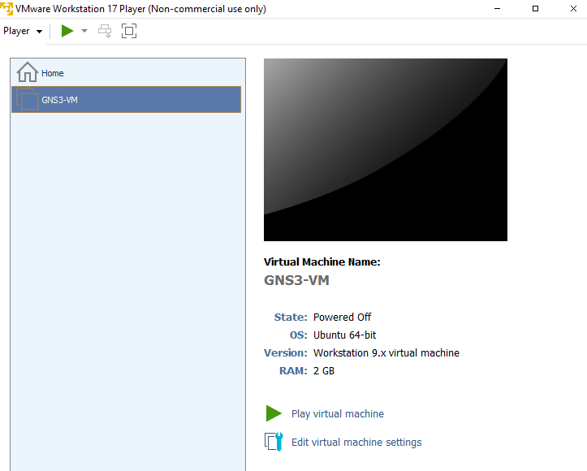

# 4. Instalación de Wireshark en Windows 10

Nos dirigimos a la página oficial de wireshark y descargamos el instalador de la versión que necesitemos para Windows. Ahora abrimos nuestro explorador de archivos y ejecutamos el instalador de wireshark (.exe):

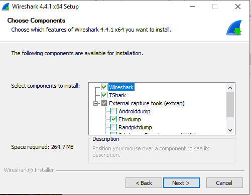

Si queremos instalar alguna herramienta externa de captura la marcamos en este recuadro, yo marcaré Sshdump, Ciscodump y Wifidump para realizar capturas remotas a través de ssh.

A continuación podemos instalar el programa Npcap v1.79, yo en mi caso ya tengo instalada la v1.78 porque me lo pedía GNS3, así que no instalamos nada:

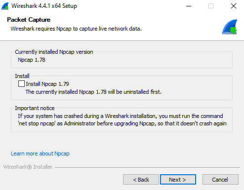

Ahora nos preguntará si queremos instalar USBPcap, lo instalamos para poder capturar el tráfico USB:

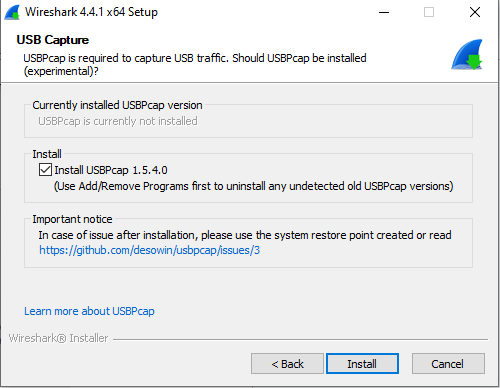

Ahora nos saldrá un cuadro que nos pide reiniciar y nos da dos opciones. Yo lo haré manualmente para cerrar antes cualquier programa que tenga abierto. Además, es recomendable que después de instalar cualquier programa reiniciéis vuestro ordenador para que los cambios se apliquen de forma correcta.

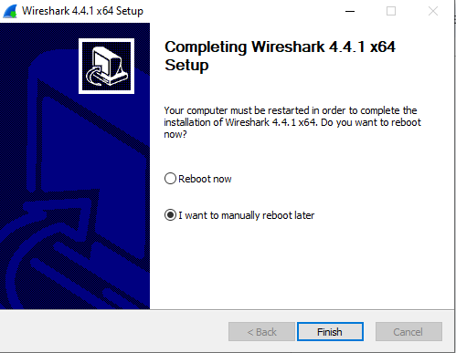

## 4.1 Funcionamiento y petición DHCP

Antes de nada debemos saber que el servidor DHCP asigna IPs, máscaras de red, la puerta de enlace y los servidores DNS que hayamos configurado a los ordenadores de una red.

Una petición DHCP se produce cuando un dispositivo solicita una dirección IP dentro de la red a la que está conectado, ya sea por cable ethernet o por conexión inalámbrica, y si hay un servidor DHCP dentro de la red le asignará automáticamente la IP (y la máscara de red, puerta de enlace y servidor DNS) a dicho dispositivo. El protocolo DHCP funciona sobre UDP: el servidor escucha en el puerto 67 y el cliente en el 68.

La captura de paquetes la realizaremos sobre la interfaz de red Ethernet:

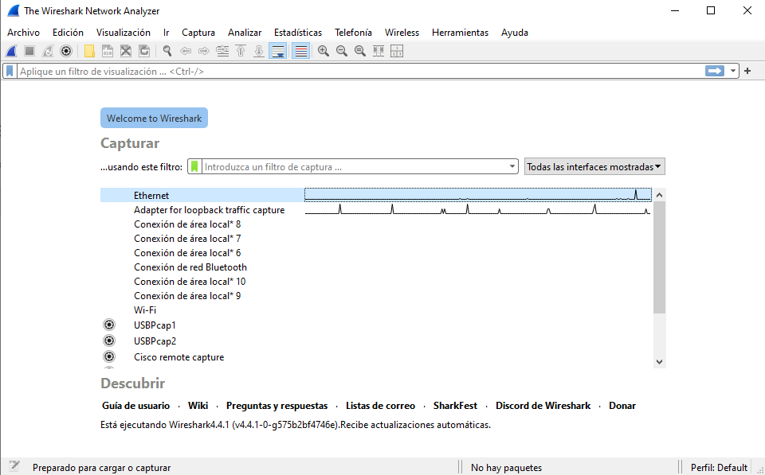

Ahora buscamos cmd en la barra de Windows y abrimos una terminal, ejecutaremos el siguiente comando:

``` bash
ipconfig /renew
```

A continuación podemos observar la petición filtrando por el puerto 67 o 68 (los puertos que usa el protocolo DHCP), por ejemplo con `udp.port == 67`. También podemos usar directamente el filtro `dhcp`.

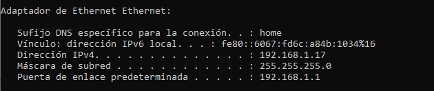

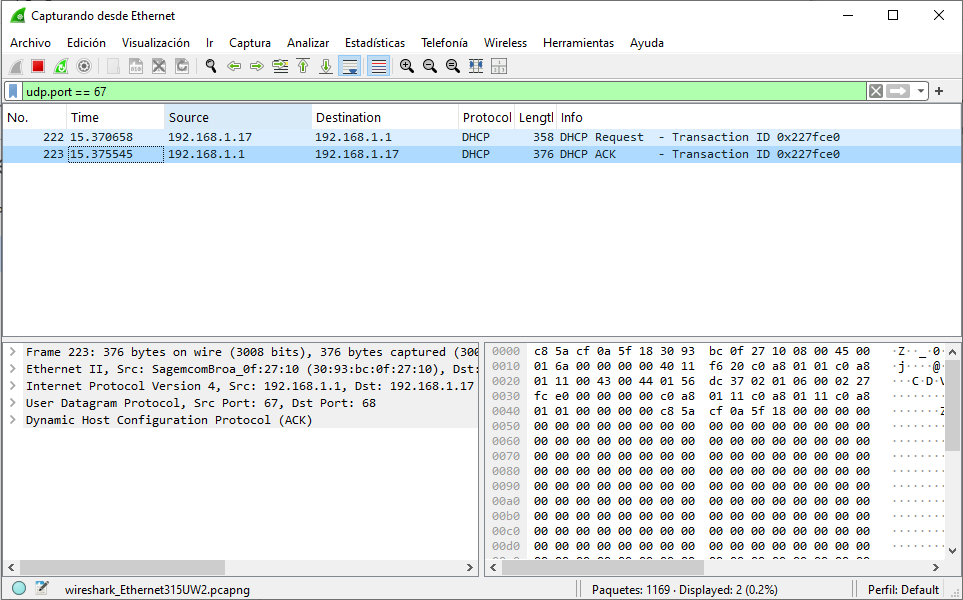

# 5. Bibliografía

[<u>https://docs.gns3.com/docs/</u>](https://docs.gns3.com/docs/)

[<u>https://www.wireshark.org/</u>](https://www.wireshark.org/)

[<u>https://github.com/GNS3/gns3-gui/releases</u>](https://github.com/GNS3/gns3-gui/releases)

[<u>https://superuser.com/questions/1788720/how-to-install-gns3-on-debian12</u>](https://superuser.com/questions/1788720/how-to-install-gns3-on-debian12)

[<u>https://www.bing.com/videos/riverview/relatedvideo?&q=que+es+un+servidor+dhcp&&mid=32CDAA0F57D87D4420F332CDAA0F57D87D4420F3&&FORM=VRDGAR</u>](https://www.bing.com/videos/riverview/relatedvideo?&q=que+es+un+servidor+dhcp&&mid=32CDAA0F57D87D4420F332CDAA0F57D87D4420F3&&FORM=VRDGAR)

[<u>https://www.redeszone.net/tutoriales/internet/que-es-protocolo-dhcp/</u>](https://www.redeszone.net/tutoriales/internet/que-es-protocolo-dhcp/)

[<u>https://www.cloudflare.com/es-es/learning/dns/what-is-dns/</u>](https://www.cloudflare.com/es-es/learning/dns/what-is-dns/)

[<u>https://docs.docker.com/engine/install/debian/</u>](https://docs.docker.com/engine/install/debian/)
