# 1. Introducción

En esta práctica vamos a instalar el kernel 6.18.4 para debian 13, primero lo buscaré en los repositorios configurados en mi sistema:

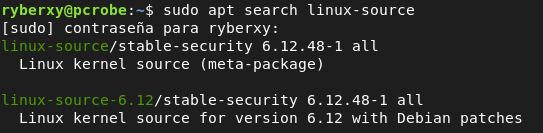

Encontramos la versión 6.12.48, que bueno no es la que queremos pero está ahí, podemos descargarla. Yo voy a buscar en la página oficial de kernel: [<u>https://kernel.org/</u>](https://kernel.org/), aquí seleccionamos la línea estable que en este caso es la 6.18.4

# 2. Descargar Dependencias Y Kernel

Instalar dependencias:

``` bash
apt install build-essential libncurses-dev bison flex libssl-dev libelf-dev bc xz-utils fakeroot debhelper libdw-dev locales rsync
```

Archivo que contiene el kernel 6.18.4:

``` bash
wget https://cdn.kernel.org/pub/linux/kernel/v6.x/linux-6.18.4.tar.xz
```

# 3. Target Y Compilación

En primer lugar vamos a ver cuantas línea tiene nuestro fichero config actual:

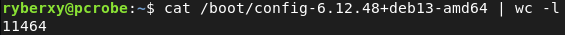

Para tener un fichero config más liviano, con la configuración mínima que usamos actualmente, es decir solo los módulos que necesitamos, ejecutamos el siguiente comando:

``` bash
make localmodconfig
```

Al haber lanzado kernel y darnos error, si queremos volver a compilar tenemos que limpiar:

make clean o make mr propper mas agresivo

Configuración con el config de un kernel antiguo:

``` bash
make oldconfig
```

Es una configuración con mucho más contenido por lo que va a tardar más, ya que utiliza el config completo del kernel más reciente en el sistema.

También podemos personalizar nuestro kernel de modo que seleccionemos que módulos queremos que estén disponibles o cuales no:

``` bash
make xconfig
```

Finalmente nuestro config tiene los siguientes módulos en estático y dinámico::

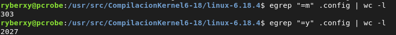

Compilación del kernel:

``` bash
make -j$(proc) bindeb-pkg
```

Instalar los paquetes .deb generados:

``` bash
sudo dpkg -i *.deb
```

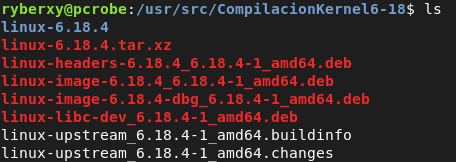

Comprobación de que el kernel se ha instalado

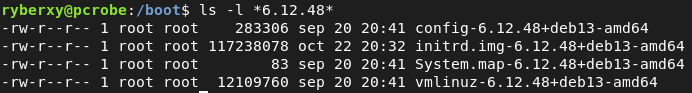

# 4. Kernel Firmado

Lo que queremos hacer es firmar la nueva compilación del kernel de modo que nuestro sistema pueda confiar en ella.

Security boot:

``` bash
sudo mokutill --sb-state
```

Para ver que claves están usándose en mi sistema:

``` bash
sudo mokutil --list-enrolled
```

Construimos el siguiente directorio:

``` bash
sudo mkdir -p /var/lib/shim-signed/mok
cd /var/lib/shim-signed/mok
```

A continuación genero la clave privada y certificado, pero el certificado por alguna razón no me deja convertirlo a .pem:

``` bash
sudo openssl req -new -newkey rsa:2048 -keyout MOK.priv -outform DER -out MOK.der -days 36500 -subj "/CN=Robemr"
```

Entonces genero otro certificado autofirmado por la clave privada generada en la anterior instrucción:

``` bash
sudo openssl req -new -x509 -sha256 -key MOK.priv -out MOK.pem -days 36500 -subj "/CN=Robemr/"
```

Ahora generamos el binario .der con el que trabajara el sistema, a partir del certificado en formato pem:

``` bash
sudo openssl x509 -in MOK.pem -outform DER -out MOK.der
```

Importaremos el certificado en formato binario(.der) para que lo entienda el sistema y nos pedirá una contraseña de un solo uso, no tiene nada que ver con la frase de paso de la clave privada:

``` bash
sudo mokutil --import MOK.der
```

Posteriormente reiniciaré para activar la clave:

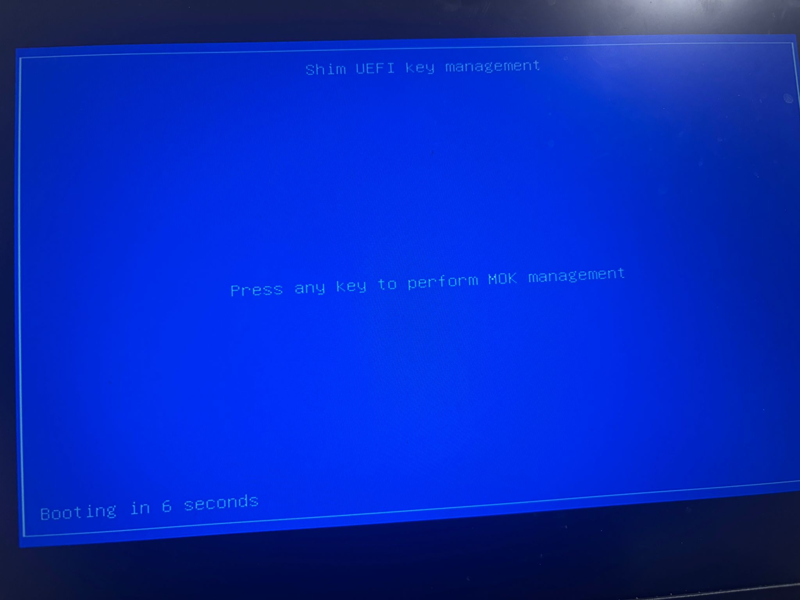

**Seleccionamos Enroll MOK**

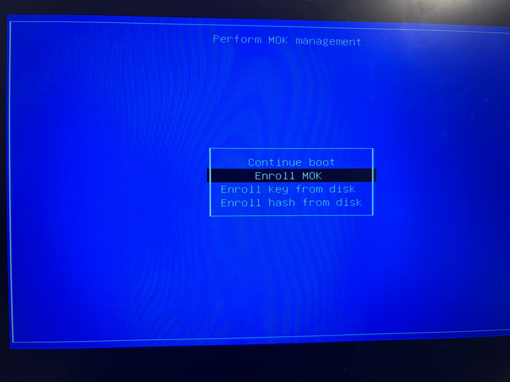

**Aquí vemos la firma realizada:**

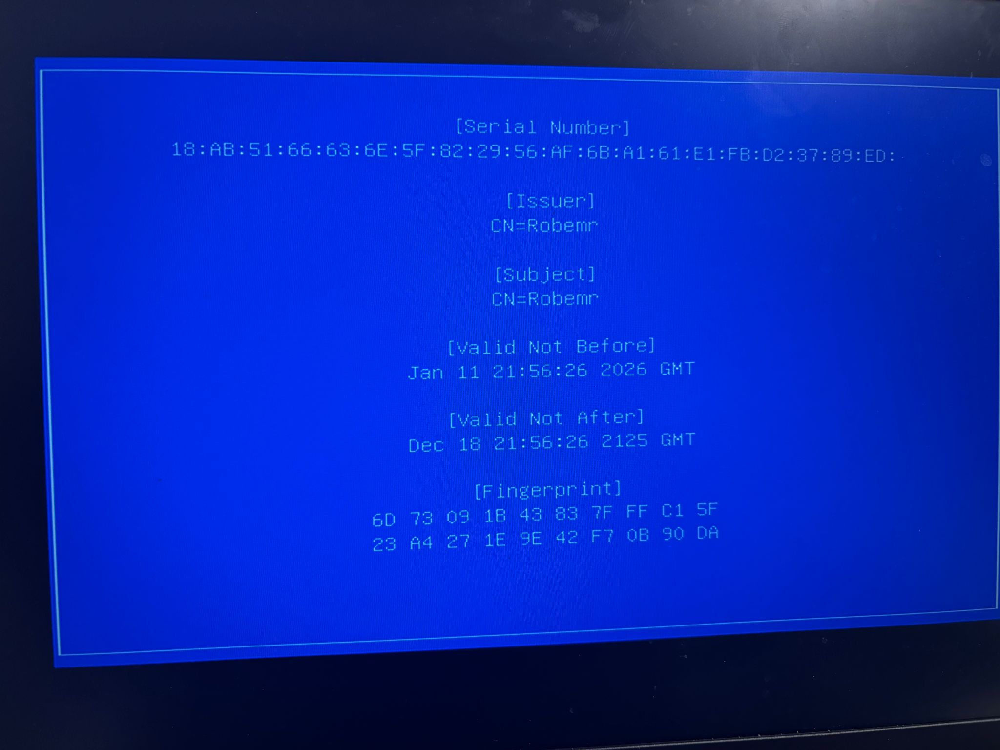

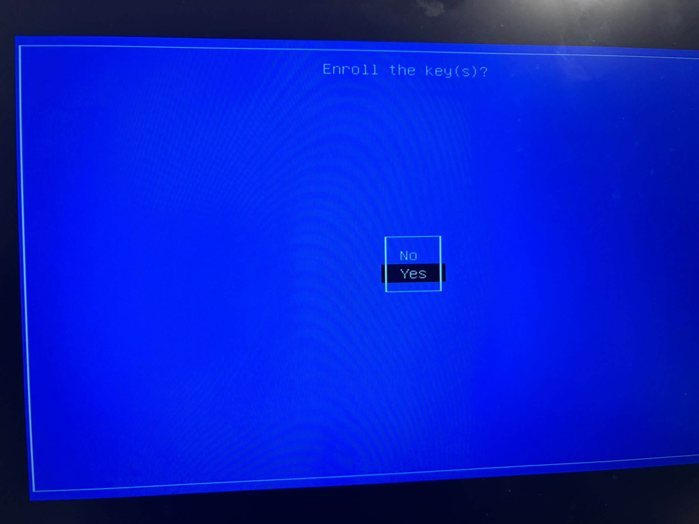

Posterior a cargar la clave, reiniciamos:

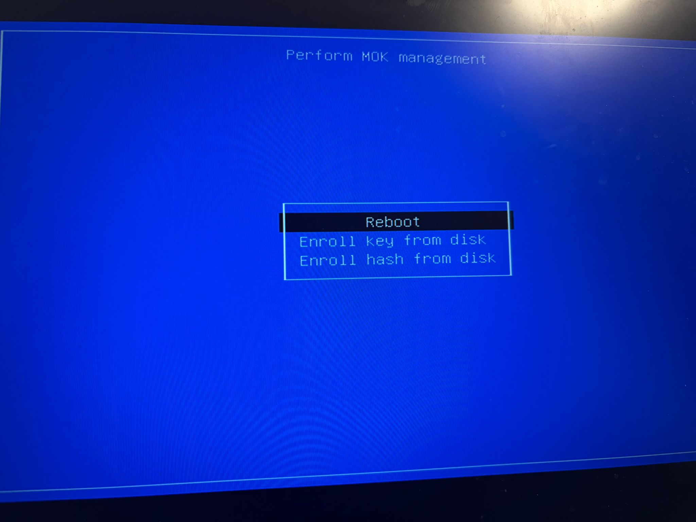

Para comprobar si la clave se ha activado y ya tenemos el kernel firmado podemos ejecutar lo siguiente:

``` bash
root@pcrobe:/var/lib/shim-signed/mok# mokutil --test-key MOK.der
MOK.der is already enrolled
```

Listar las claves cargadas en nuestro sistema:

``` bash
sudo mokutil --list-enrolled
```

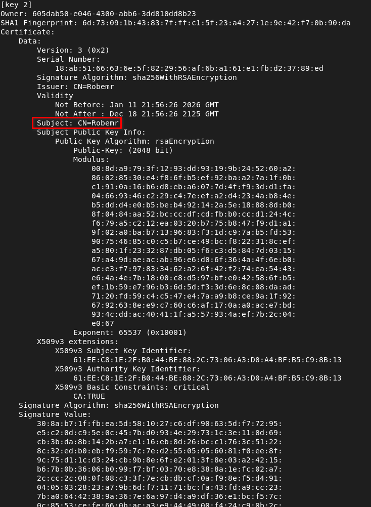

Finalmente, lo que he aprendido con la práctica es que debemos tener activado el secure boot y para hacer las cosas lo mejor posible, no tendríamos que desactivarlo en ningún momento, de este modo habría que firmar el kernel para que el sistema confíe en él.
