# 1. ¿QUÉ ES UNA VPN?

Una VPN o red virtual privada es un método que sirve para crear una interconexión entre dos redes que no están conectadas directa y físicamente, de forma que se encapsula la trama TCP/IP dentro de la trama de la VPN, de modo que se obtienen datos comprimidos, cifrados asimétricamente y autentificación de usuarios.

Un ejemplo es un usuario que intenta acceder a la red interna de su empresa desde su casa. Este sería un ejemplo de acceso remoto.

## 1.1 VPN DE ACCESO REMOTO

El cliente se conecta a otra red utilizando un software, cuando la conexión llega al servidor destino, este nos permite conectarnos con su red como si nuestra máquina estuviese allí físicamente, entonces tendremos acceso a los recursos de esa red y accederemos a internet desde ella, pero realmente iniciando la conexión remota desde nuestra ubicación física.

## 1.2 VPN SITE TO SITE

Este es el tipo de VPN que suelen utilizar las empresas, ya que sirve para interconectar dos sedes por ejemplo.

El site to site consiste en la creación de un tunel intermedio que permite a cada servidor de vpn coger las peticiones de sus clientes y mandarlas por ese túnel para que puedan acceder a los recursos de la otra red. Cabe destacar que aunque haya dos servidores vpn uno actúara de cliente al otro.

# 2. VPN DE ACCESO REMOTO OPENVPN

Tenemos un servidor conectado a dos redes, y un cliente por otro lado que tiene que acceder a los servidores de esas redes

El servidor VPN será un contenedor LXC y el cliente VPN una instancia de OpenStack.

## 2.1 CERTIFICADOS Y CLAVES

Con esta instrucción generaré el fichero de solicitud en el cliente, que posteriormente será firmado por la CA:

``` bash
openssl req -new -key /etc/ssl/private/debiansecurity.key -out /root/debianOS.csr
```

En el servidor de vpn generamos los parametros Diffie-Helman:

``` bash
openssl dhparam -out /etc/openvpn/dh.pem 2048
```


Montamos la Autoridad certificadora en el mismo servidor de VPN:

``` bash
openssl genrsa -aes256 -out /home/ryberxy/CA/private/ca_key.pem 4096
chmod 600 private/ca_key.pem
openssl req -config ~/CA/openssl.cnf \
-key ~/CA/private/ca_key.pem \
-new -x509 -days 3650 -sha256 \
-extensions v3_ca \
-out ~/CA/certsdb/ca_cert.pem
# Clave privada local
openssl genrsa -out /etc/ssl/private/server.key 4096
```

Firmaremos el certificado local del servidor por la CA y también firmaremos el del cliente:

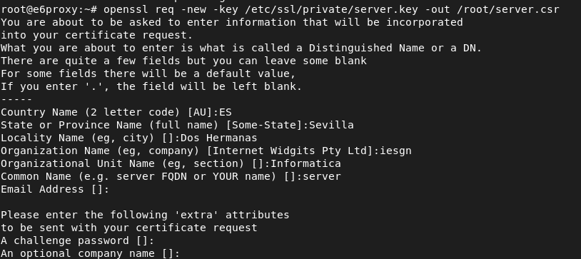

Opcionalmente podemos generar una clave compartida, que utilizará openvpn para firmar los paquetes que se transmiten en el túnel de VPN, esta clave utilizará la autentificación TLS, la generamos de la siguiente forma:

``` bash
sudo openvpn --genkey secret ta.key
```

## 2.2 SUMINISTRACIÓN DE CLAVES

Ahora compartiremos las claves y certificados al directorio /etc/openvpn/bunchkeys:

``` bash
root@e6proxy:~# mkdir /etc/openvpn/bunchkeys
root@e6proxy:~# cp CA/certsdb/ca_cert.pem /etc/openvpn/bunchkeys/
root@e6proxy:~# cp /root/server.pem /etc/openvpn/bunchkeys/
root@e6proxy:~# cp /etc/ssl/private/server.key /etc/openvpn/bunchkeys/
root@e6proxy:~# cp /root/ta.key /etc/openvpn/bunchkeys/
```

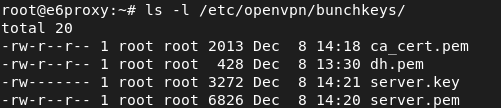

**Cliente:**

Debemos tener la clave privada local del cliente, el certificado de la CA y el certificado del cliente firmado por la CA, esto lo moveremos al directorio de openvpn:

``` bash
mkdir /etc/openvpn/bunchkeys
cp /etc/ssl/private/debianOS.key /etc/openvpn/bunchkeys/
cp /etc/ssl/private/ca_cert.pem /etc/openvpn/bunchkeys/
cp /etc/ssl/private/debianOS.pem /etc/openvpn/bunchkeys/
```

## 2.3 PREPARACIÓN PREVIA DEL SERVIDOR

Como voy a usar un contenedor lxc para el servidor vpn, tendré que configurar br0, un puente directo a mi red, lo haré con NetworkManager:


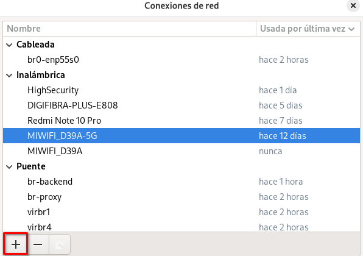

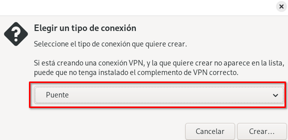

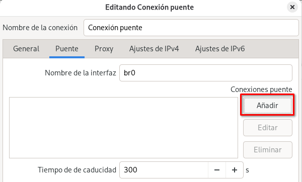

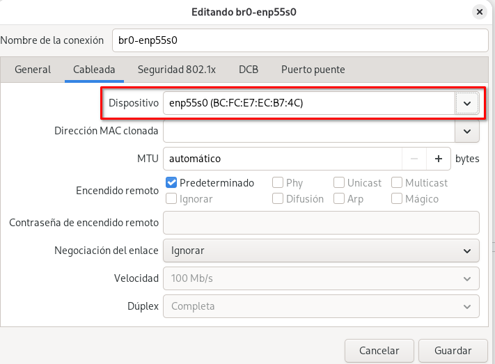

Ahora en /var/lib/lxc/name_contenedor/config indicamos la interfaz br0.

## 2.4 CONFIGURACIÓN VPN

#### 2.4.1 SERVIDOR:

Como voy a utilizar un contenedor lxc y este usa el kernel del host, tendremos que cargar el módulo tun en el host:

``` bash
root@pcrobe:/home/ryberxy# modprobe tun
root@pcrobe:/home/ryberxy# lsmod | grep tun
tun 69632 2
```

Para hacerlo persistente tras reinicio:

``` bash
echo "tun" >> /etc/modules
```

Ahora en la configuración del contenedor:

``` bash
nano /var/lib/lxc/e6_proxy/config
# Permite el dispositivo TUN
lxc.cgroup2.devices.allow = c 10:200 rwm
# Monta el dispositivo
lxc.mount.entry = /dev/net dev/net none bind,create=dir 0 0
# Desactiva AppArmor
lxc.apparmor.profile = unconfined
# Para manterner las capabilities necesarias
lxc.cap.drop =
```

Desde el contenedor comprobamos que existe el dispositivo y que tenemos permisos sobre él:

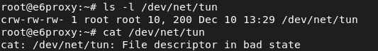

**Configuración del servidor vpn:**

``` bash
/etc/openvpn/server/server-home.conf:
#Dispositivo de túnel
dev tun

#Protocolo
proto tcp

#Direcciones IP virtuales
server 10.99.99.0 255.255.255.0

#subred local
push "route 192.168.1.0 255.255.255.0"
push "route 192.168.144.0 255.255.255.0"
push "route 10.0.0.0 255.255.255.0"

# Rol de servidor
tls-server

#Par metros Diffie-Hellman
dh /etc/openvpn/bunchkeys/dh.pem

#Certificado de la CA
ca /etc/openvpn/bunchkeys/ca_cert.pem

#Certificado local
cert /etc/openvpn/bunchkeys/server.pem

#Clave privada local
key /etc/openvpn/bunchkeys/server.key

#Activar la compresión LZO
comp-lzo

#Detectar ca das de la conexión
keepalive 10 60

#Nivel de información
verb 3
```

Configuraremos una regla snat para cambiar la ip origen del cliente vpn por la del servidor y así pueda acceder a los recursos de la red.

``` bash
iptables -t nat -A POSTROUTING -s 10.99.99.0/24 -o eth0 -j MASQUERADE
```

**Habilitar servicio:**

``` bash
systemctl start openvpn-server@server
```

#### 2.4.2 CLIENTE:

``` bash
#Dispositivo de túnel
dev tun

#Direcciones remota
remote vpn.ejemplo.com

#Aceptar directivas del extremo remoto
pull
#Protocolo
proto tcp-client
#Rol de cliente
tls-client

#Certificado de la CA
ca /etc/openvpn/bunchkeys/ca_cert.pem

#Certificado local
cert /etc/openvpn/bunchkeys/debianOS.pem

#Clave privada local
key /etc/openvpn/bunchkeys/debiansecurity.key

#Activar la compresión LZO
comp-lzo

#Detectar caídas de la conexión
keepalive 10 60

# logs
log /var/log/openvpn-home.log

#Nivel de información
verb 3
```

**Habilitar servicio:**

``` bash
systemctl start openvpn-client@client
```

En mi caso, al haber utilizado un contenedor en mi red local, tendré que abrir el puerto que utiliza openvpn en el router, es decir haré snat con ese puerto hacia la dirección del contenedor:

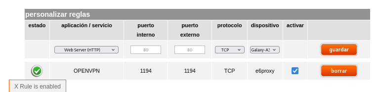

**Funcionamiento:**

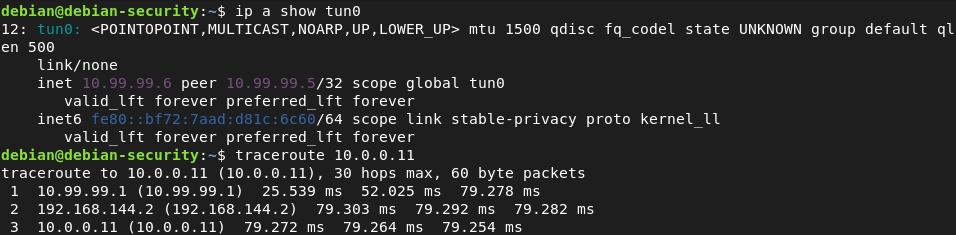

**Cliente → Red y subred del servidor**

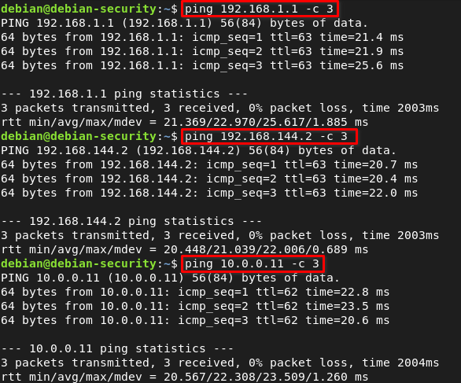

**Verificación de certificados:**

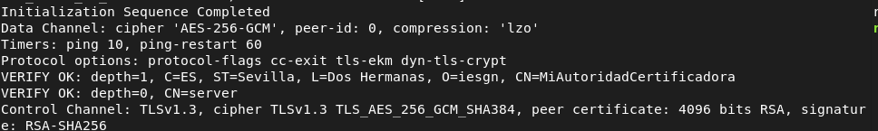

# 3. EASY-RSA PARA OPENVPN

Construir estructura pki (Autoridad certificadora):

``` bash
./easyrsa init-pki
```

Generar parámetros Diffie-Hellman:

``` bash
./easyrsa gen-dh
```

Generar certificado de la CA:

``` bash
sudo ./easyrsa build-ca nopass
```

Generar certificado del servidor 1:

``` bash
./easyrsa gen-req servidor1 nopass
```

Firmar certificado servidor 1:

``` bash
./easyrsa sign-req server servidor1
```

Firmar certificado cliente:

```bash
sudo ./easyrsa sign-req client servidor2
```

Por último pasamos las claves al directorio de /etc/openvpn/bunchkeys y operamos como hicimos anteriormente.
