# 1. VPN ACCESO REMOTO WIREGUARD

Seguiremos el mismo escenario que anteriormente, ahora la máquina contenedor será el servidor VPN de acceso remoto mientras que la instancia de openstack será el cliente que va a acceder.

Para comenzar vamos a instalar wireguard en cada máquina:

``` bash
sudo apt update && sudo apt install wireguard
```

## 1.1 CONFIGURACIÓN DEL SERVIDOR1

Para que el tráfico de la vpn con wireguard sea cifrado, vamos a generar las claves con la herramienta wg, que trae wireguard por defecto.

**Clave privada:**

``` bash
wg genkey
```

**Clave pública:**

``` bash
wg pubkey
```

Almacenaremos las claves en /etc/wireguard cada una en un fichero diferente, con el siguiente comando podemos realizar las dos instrucciones a la vez:

``` bash
wg genkey | sudo tee /etc/wireguard/private.key | wg pubkey | sudo tee /etc/wireguard/public.key
```

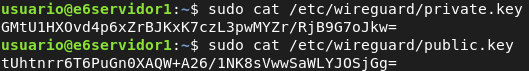

Ahora vamos a configurar el servidor para poder acceder desde el cliente:

``` bash
[Interface]
# Dirección IP del túnel de VPN Servidor
Address = 10.99.99.1
#Clave privada del servidor
PrivateKey = GMtU1HXOvd4p6xZrBJKxK7czL3pwMYZr/RjB9G7oJkw=
#Puerto de escucha , 51820 es el puerto por defecto de Wireguard
ListenPort = 51820

# Si no tienes activado el bit de forwarding por defecto puedes hacerlo asi :
PreUp = sysctl -w net.ipv4.ip_forward=1

# Configuración de la sección clientes
[Peer]
# Clave pública del cliente
Publickey = q1IATbSN3fw/tB24KRWiHSHusIWk8a6RhJ1Yd32Cohs=
# IP del túnel VPN del cliente
AllowedIPs = 10.99.99.2/32
# Tiempo de espera para apagar el túnel si no hay tráfico
PersistentKeepAlive = 30
```

Con \[interface\] definimos la interfaz virtual que será wg0, mientras que \[peer\] sirve para configurar los clientes que van a acceder al túnel.

Levantamos la interfaz virtual:

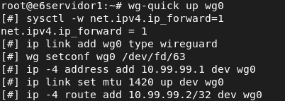

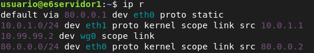

## 1.2 CONFIGURACIÓN DEL SERVIDOR2 (CLIENTE)

También hemos generado sus claves de la misma forma que con el servidor 1:

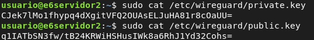

**Configuración del fichero cliente:**

``` bash
[Interface]
Address = 10.99.99.2/32
#Clave privada del cliente
PrivateKey = CJek7lMo1fhypq4dXgitVFQ2OUAsELJuHA81r8cOaUU=

#Puerto de escucha del servidor por defecto
ListenPort = 51820

[Peer]
# Clave pública del servidor
PublicKey = tUhtnrr6T6PuGn0XAQW+A26/1NK8sVwwSaWLYJOSjGg=
AllowedIPs = 0.0.0.0/0
# Punto de acceso por donde se accede al servidor
Endpoint = 80.0.0.2:51820
#Tiempo de espera de la conexión
PersistentKeepalive = 30
```

Levantamos la interfaz virtual:

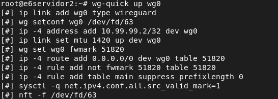

**Enrutamiento:**

Como vemos no aparecen rutas que apunten a 10.99.99.0/24, eso es porque se ha creado una tabla aparte para las rutas de la vpn, ya que estamos usando tunelado para cualquier dirección ip (0.0.0.0), entonces estas rutas no aparecen en la tabla main que es la que controla el enrutamiento en Linux.

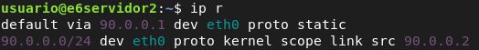

Con el siguiente comando podemos ver la ruta escrita en la tabla del túnel VPN:


#### 1.2.1 FUNCIONAMIENTO

Puede alcanzar la red 10.0.1.0/24 y salir a internet por el túnel:

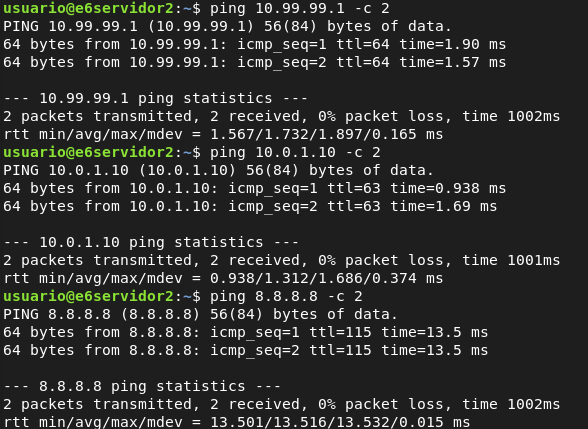

## 1.3 CONFIGURACIÓN DE CLIENTE WINDOWS

En el servidor VPN generamos las claves para el cliente Windows de la misma forma que anteriormente:

``` bash
wg genkey | tee windowsprivate | wg pubkey | tee windowspublic
```

Configuramos un fichero que será el túnel del cliente Windows, windows.conf:

``` bash
[Interface]
Address = 10.99.99.3
PrivateKey = +Cis2XVRdbc/UVGrmEwy3Hcm5fGPFnHWMmy9EBrV7EY=
ListenPort = 51820
[Peer]
Publickey = tUhtnrr6T6PuGn0XAQW+A26/1NK8sVwwSaWLYJOSjGg=
AllowedIPs = 0.0.0.0/0
Endpoint = 80.0.0.2:51820
```

En el servidor VPN configuramos una sección peer para el cliente:

``` bash
nano /etc/wireguard/wg0.conf
[Peer]
#Clave pública del cliente
Publickey = vMtMURebGTXAKXBHYFGY3S6pJtPusRw5kqo3Prtx9yE=
#IP del túnel VPN del cliente
AllowedIPs = 10.99.99.3/32
#Tiempo de espera que tendrá activo el túnel si no hay trafico
PersistentKeepAlive = 30
```

Para pasarle al cliente windows su fichero de configuración, montaremos un servidor web en el servidor VPN, lo haré con python, pero siempre en un entorno que no sea real.

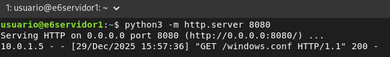

Descargar el archivo desde el cliente Windows:

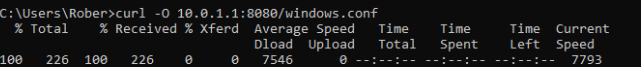

**Activamos el túnel:**

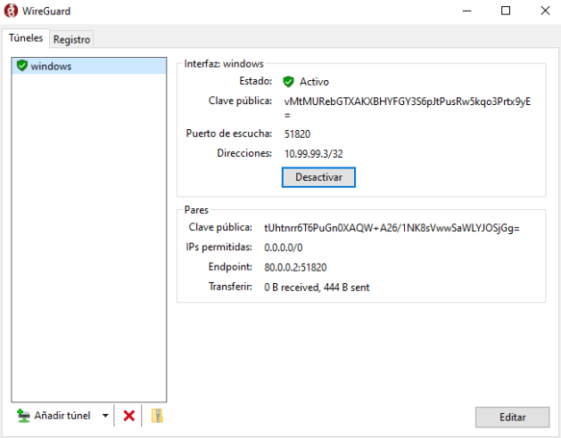

#### 1.3.1 FUNCIONAMIENTO

Configuración IP:

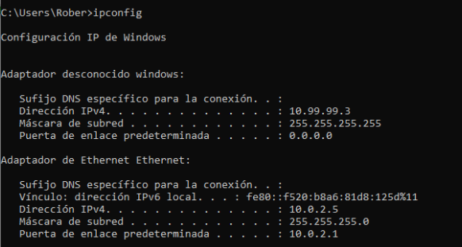

Desde el servidor podemos comprobar los clientes conectados, y el windows está(10.99.99.3):

``` bash
sudo wg show
```

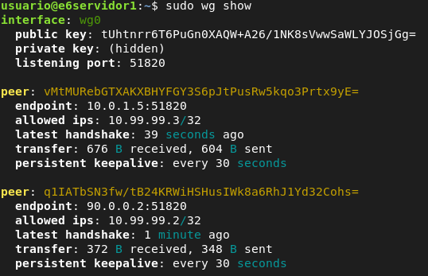

Desde el cliente Windows accedemos a la red interna del servidor 1 y a internet:

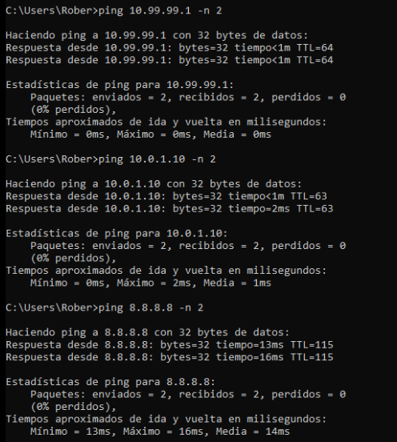

## 1.4 CONFIGURACIÓN DE CLIENTE ANDROID

En nuestro servidor de VPN generaremos las claves para el cliente android:

``` bash
wg genkey | tee androidprivate | wg pubkey | tee androidpublic
```

Configuramos el android.conf, que es el fichero de configuración de wireguard para el android:

``` bash
[Interface]
Address = 10.99.99.4
PrivateKey = wAaPZogR7qLnxYNNIF5eBm6eCgkaluYVRm/EHua0YEU=
ListenPort = 51820

[Peer]
Publickey = tUhtnrr6T6PuGn0XAQW+A26/1NK8sVwwSaWLYJOSjGg=
AllowedIPs = 0.0.0.0/0
Endpoint = 80.0.0.2:51820
```

Mientras que en el servidor añadimos otra sección de peer, como dijimos antes sirve para configurar el acceso de un cliente al túnel de VPN:

``` bash
nano /etc/wireguard/wg0.conf
[Peer]
#Clave pública del cliente
Publickey = FCFKS6N/Lmhx4eAPNV54cNaSw3iRvk1SoQaL5mPZml8=
#IP del túnel VPN del cliente
AllowedIPs = 10.99.99.4/32
#Tiempo de espera que tendrá activo el túnel si no hay trafico
PersistentKeepAlive = 25
```

Lo descargamos desde el android con wget, primero montamos un servidor web en el puerto 8080 con python por ejemplo, en el servidor VPN. Cuidado, esto no es seguro en un entorno real.

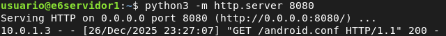

Desde el cliente android:

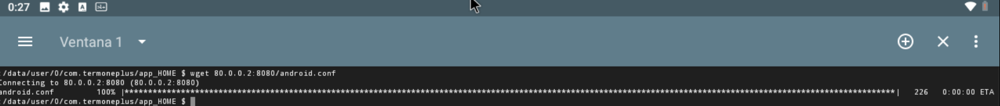

Ahora movemos el archivo a descargas:


Si nos hace falta permisos de superusuario, utilizamos:

``` bash
su -
```

Ahora desde el cliente android, podemos acceder a toda la red de la vpn, al igual que antes desde el cliente linux, a pesar de que el cliente android está en la red 10.0.1.0/24 físicamente.

Si queremos que se salga a internet por wg0 desde los clientes vpn, en el servidor de VPN tendremos que configurar una regla SNAT para la dirección del tunel:

``` bash
iptables -t nat -A POSTROUTING -s 10.99.99.0/24 -o eth0 -j MASQUERADE
```

#### 1.4.1 FUNCIONAMIENTO

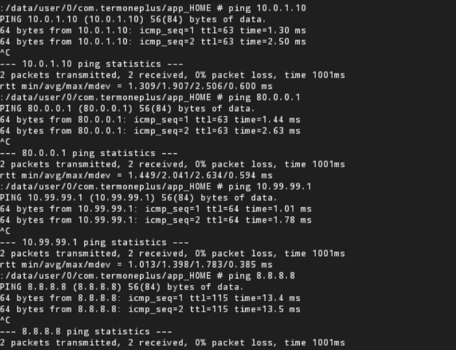
