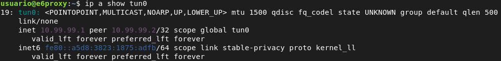
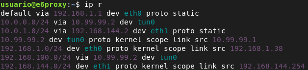
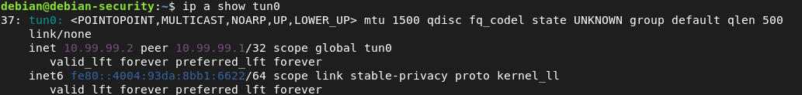
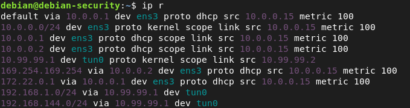
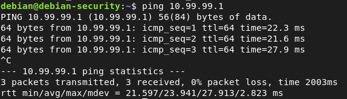
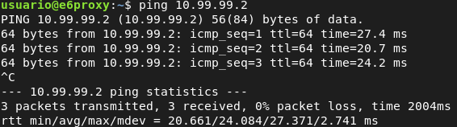
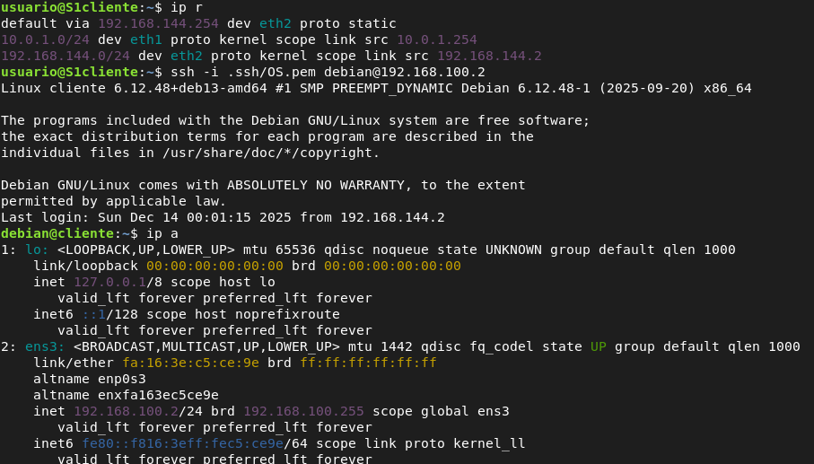
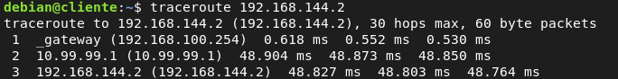

# 1. VPN SITE TO SITE OPENVPN

## 1.1 CONFIGURACIÓN DE RED OPENSTACK - SERVIDOR2

Para esta configuración de vpn necesitamos que un cliente de una red pueda acceder a otro cliente de la red del otro extremo, para ello necesitamos que nuestra instancia de openstack sea un router linux y tenga clientes conectados en su red.

``` bash
# Creamos la red
openstack network create red-interna
# Creamos la subred sin gateway, ya que la configuramos después
openstack subnet create subnet-interna --network red-interna --subnet-range 192.168.100.0/24 --gateway none --no-dhcp
# Creamos el puerto que será la interfaz del router
openstack port create --network red-interna --fixed-ip subnet=subnet-interna,ip-address=192.168.100.254 puerto-router-interna
# Colocamos el puerto al router
openstack server add port debian_Security puerto-router-interna
# Creamos el puerto del cliente
openstack port create --network red-interna --fixed-ip ip-address=192.168.100.2 port_cliente
# Creamos la instancia cliente
openstack server create --flavor m1.mini \
--image "Debian 13 Trixie" \
--security-group default \
--key-name OS \
--port port_cliente \
cliente
# Deshabilitamos la seguridad de puertos del cliente para que su tráfico no se interprete como amenaza y sea bloqueado, ya que es una red interna y openstack puede interpretarla como amenaza.
openstack port set --disable-port-security port_cliente
```

## 1.2 CONFIGURACIÓN VPN

#### 1.2.1 SERVIDOR 1:

``` bash
sudo nano /etc/openvpn/server/server1.conf
#Protocolo
proto tcp-server
#Dispositivo de tunel
dev tun

#Direcciones IP virtuales
ifconfig 10.99.99.1 10.99.99.2

#Ruta para llegar de servidor1 a servidor2
route 10.0.0.0 255.255.255.0
route 192.168.100.0 255.255.255.0

# Rol de servidor
tls-server

#Parámetros Diffie-Hellman
dh /etc/openvpn/bunchkeys/dh.pem

#Certificado de la CA
ca /etc/openvpn/bunchkeys/ca_cert.pem

#Certificado local
cert /etc/openvpn/bunchkeys/server.pem

#Clave privada local
key /etc/openvpn/bunchkeys/server.key

#Activar la compresión LZO
comp-lzo

#Detectar caídas de la conexión
keepalive 10 60

#Nivel de información
verb 3
```

#### 1.2.2 SERVIDOR 2:

``` bash
sudo nano /etc/openvpn/server/server2.conf

#Dispositivo de túnel
dev tun

#Direcciones remota
remote 85.50.230.73

#Aceptar directivas del extremo remoto
ifconfig 10.99.99.2 10.99.99.1
#Rutas para conectar con las demás interfaces de Servidor 1.
route 192.168.1.0 255.255.255.0
route 192.168.144.0 255.255.255.0

#Protocolo
proto tcp-client

#Rol de cliente
tls-client

#Certificado de la CA
ca /etc/openvpn/bunchkeys/ca_cert.pem

#Certificado local
cert /etc/openvpn/bunchkeys/debianOS.pem

#Clave privada local
key /etc/openvpn/bunchkeys/debiansecurity.key

#Activar la compresión LZO
comp-lzo

#Detectar caídas de la conexión
keepalive 10 60

# logs
log /var/log/openvpn-home.log

#Nivel de información
verb 3
```

## 1.3 FUNCIONAMIENTO

**Servidor 1**





**Servidor 2**





**PING ENTRE AMBOS SERVIDORES**

**Servidor 2 → Servidor 1**



**Servidor 1 → Servidor 2**



**Conexión ssh Cliente del servidor 1 → cliente del servidor 2**



**Conexión Cliente del servidor 2 → Cliente del servidor 1**


