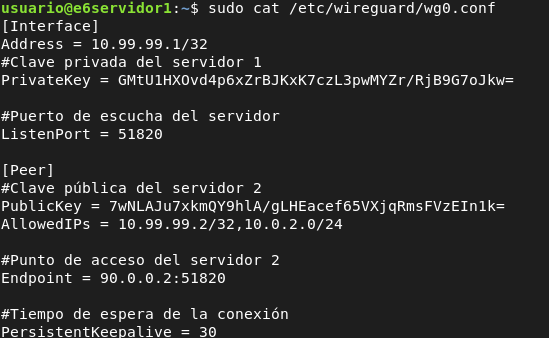
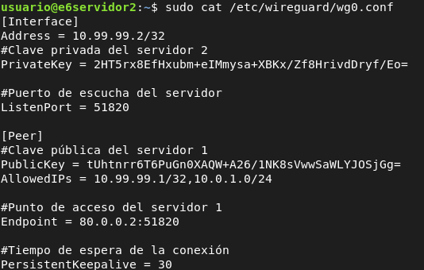
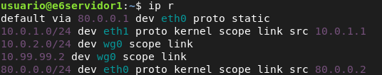
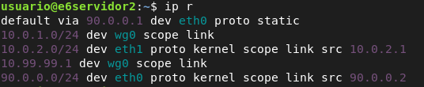
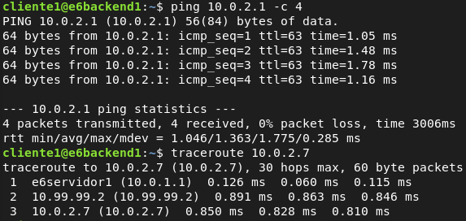
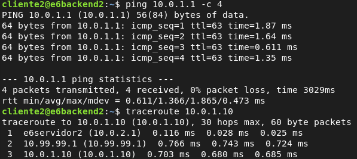

# 1. VPN SITE TO SITE WIREGUARD

Necesitaremos dos servidores, el servidor 1 y el servidor 2, por lo tanto generamos las claves en cada servidor, si aún no las tenemos:

``` bash
wg genkey | sudo tee /etc/wireguard/private.key | wg pubkey | sudo tee /etc/wireguard/public.key
```

## 1.1 CONFIGURACIÓN DEL SERVIDOR 1



``` bash
wg-quick up wg0
```

## 1.2 CONFIGURACIÓN DEL SERVIDOR 2



``` bash
wg-quick up wg0
```

## 1.3 FUNCIONAMIENTO

**Enrutamiento servidor 1:**



**Enrutamiento servidor 2:**



**Cliente 1 → Red Servidor 2**



**Cliente 2 → Red Servidor 1**


